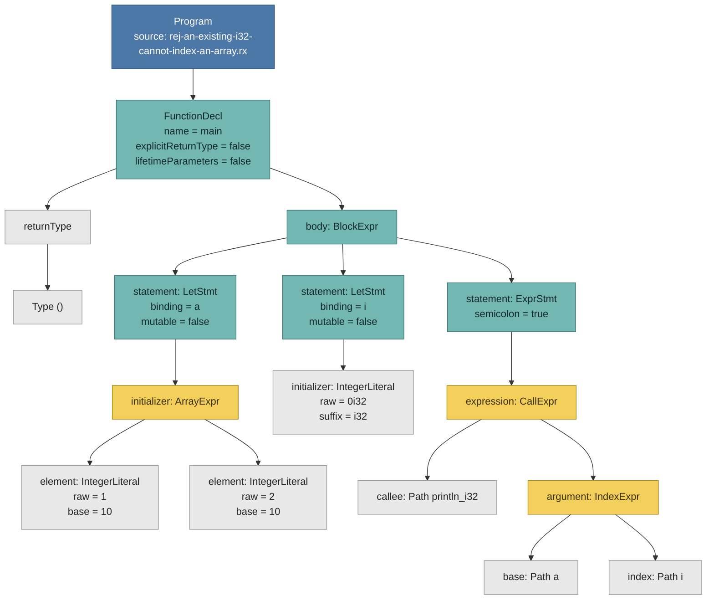

# 这是体系结构课大作业Rx编译器的仓库，使用c++语言完成。使用antlr4库构建抽象语法树的代码已经编写完毕，位于sr…

> 这是体系结构课大作业Rx编译器的仓库，使用c++语言完成。使用antlr4库构建抽象语法树的代码已经编写完毕，位于src和include下。请你阅读作业要求template/README-ZH.md，docs/Rx Compiler Specification(Chinese).md和tests/README-ZH.md，编写第二部分semantic检查的代码，调试直到通过test中的语义检查测试。

<details><summary>14 previous messages</summary>

> 我会先通读作业要求、语义检查测试说明和现有 AST/解析代码，确认接口与错误格式，再实现 semantic 检查并运行测试，逐项修复直到通过。
>
> <details><summary>Explored 4 files, ran 6 commands</summary>
>
> - Ran `Get-ChildItem -Force; Write-Output '--- files ---'; rg --files template docs tests src include | Sort-Object`
>
> <details><summary>Explored 2 files</summary>
>
> - Read `./tests/README-ZH.md`
> - Read `./template/README-ZH.md`
>
> </details>
>
> - Ran `Get-Content -Raw -LiteralPath 'docs/Rx Compiler Specification(Chinese).md'`
>
> <details><summary>Explored 2 files</summary>
>
> - Read `./src/AstBuild.cpp`
> - Read `./include/AstBuild.hpp`
>
> </details>
>
> - Ran `rg -n "semantic|Semantic|TODO|NotImplemented|check" src include Makefile config.mk tests/README-ZH.md template/tests/README-ZH.md 2>$null`
>
> - Ran `Get-ChildItem src,include | Select-Object FullName,Length; Get-Content -Raw include/Ast.hpp; Get-Content -Raw include/AstBuild.hpp`
>
> - Ran `rg --files -g '!template/**' -g '!tests/**' | Sort-Object; Get-Content -Raw config.mk; Get-Content -Raw Makefile; Get-Content -Raw tests/README-ZH.md`
>
> - Ran `git status --short; git log --oneline --all -8; Get-ChildItem tests -Force | Select-Object Name; Get-Content -Raw docs/'AST Design.md'; rg -n "semantic|Semantic|checker|type" docs src include .github -g '*.md' -g '*.cpp' -g '*.hpp'`
>
> </details>
>
> 现有仓库目前只有 AST 构建层，没有 semantic checker 或编译器入口；我会补齐语义检查公共接口与命令行入口，并先用官方 semantic 测试集驱动实现。由于官方测试覆盖面很大，我会优先建立完整的类型/名字/控制流检查框架，再按失败类别迭代。
>
> <details><summary>Ran 21 commands</summary>
>
> - Ran `Get-ChildItem -Recurse -File -Path build,target | Select-Object FullName,Length | Select-Object -First 100; Get-Content -Raw tools/README.md; Get-Content -Raw tests/README.md; rg -n "semantic|SEMANTIC|AstBuild|parseSource|g\+\+|cmake" .github scripts tools -g '!tools/antlr4-cpp-runtime-4.13.2/runtime/**'`
> - Ran `Get-ChildItem tools/generated,tools/installed/antlr4-4.13.2/include/antlr4-runtime,build -ErrorAction SilentlyContinue | Select-Object FullName; rg --files | rg 'RxLexer.h|RxParser.h|CMakeLists|compiler|main.cpp' | Select-Object -First 100; Get-Content -Raw scripts/test.py | Select-String -Pattern 'SEMANTIC|env|subprocess' -Context 2,3`
> - Ran `git branch -a; git ls-tree -r --name-only e1530ae | rg 'semantic|src|include|README'; git show e1530ae:src/main.cpp 2>$null; git show e1530ae:include/AstBuild.hpp 2>$null | Select-Object -First 5`
> - Ran `$env:PATH; Get-Command cargo,rustc,make,python -ErrorAction SilentlyContinue | Format-Table Name,Source; Get-ChildItem crates/rx -Recurse -File | Select-Object FullName,Length; cargo --version 2>&1; rustc --version 2>&1`
> - Ran `rg -n "def run_semantic|semantic" scripts/test.py; Get-Content scripts/test.py | Select-Object -Skip 250 -First 130; Get-ChildItem tests/official/semantic -Directory | Measure-Object; Get-ChildItem tests/official/semantic -Recurse -Filter '*.rx' | Measure-Object`
> - Ran `Get-Command g++,clang++,cmake,ninja,git | Format-Table Name,Source; Test-Path tools/installed/antlr4-4.13.2/lib/libantlr4-runtime.a; Get-ChildItem tools/installed/antlr4-4.13.2/lib -ErrorAction SilentlyContinue`
> - Ran `Get-Content -Raw grammar/Parser.g4; Get-Content -Raw grammar/Lexer.g4`
> - Ran `git remote -v; git log --all --stat --oneline | Select-Object -First 40; git ls-tree -r --name-only origin/main | rg 'semantic|src|include' | Select-Object -First 100`
> - Ran `$p='docs/Rx Compiler Specification(Chinese).md'; $c=Get-Content $p; $ranges=@(@(350,460),@(460,570),@(570,690),@(690,820)); foreach($r in $ranges){Write-Output "--- $($r[0])-$($r[1]) ---"; $c[($r[0]-1)..($r[1]-1)]}`
> - Ran `$inc='tools/installed/antlr4-4.13.2/include/antlr4-runtime'; g++ -std=c++17 -Iinclude -Itools/generated -I$inc -c src/AstBuild.cpp -o $env:TEMP\ast.o`
> - Ran `$inc='tools/installed/antlr4-4.13.2/include/antlr4-runtime'; g++ -std=c++17 -Iinclude -Itools/generated -I$inc -c src/AstBuild.cpp -o "$env:TEMP\ast.o"; if ($LASTEXITCODE -eq 0) { Write-Output ok }`
> - Ran `Get-ChildItem tools/installed/antlr4-4.13.2/include/antlr4-runtime -Filter '*runtime*' | Select-Object Name; Test-Path tools/installed/antlr4-4.13.2/include/antlr4-runtime/antlr4-runtime.h; Get-Item tools/installed/antlr4-4.13.2/include/antlr4-runtime/antlr4-runtime.h`
> - Ran `g++ -std=c++17 -Iinclude -Itools/generated -Itools/installed/antlr4-4.13.2/include/antlr4-runtime -c src/AstBuild.cpp -o ast.o; if ($LASTEXITCODE -eq 0) { Write-Output ok }`
> - Ran `$p=(Resolve-Path tools/installed/antlr4-4.13.2/include/antlr4-runtime).Path; Write-Output $p; g++ -std=c++17 "-Iinclude" "-Itools/generated" "-I$p" -c src/AstBuild.cpp -o ast.o`
> - Ran `Get-Content src/AstBuild.cpp | Select-Object -Skip 300 -First 180`
> - Ran `Get-ChildItem -Path C:\Users\ASUS -Recurse -Filter rustc.exe -ErrorAction SilentlyContinue | Select-Object -First 20 FullName; Get-ChildItem -Path C:\ -Recurse -Filter rustc.exe -ErrorAction SilentlyContinue | Select-Object -First 20 FullName`
> - Ran `Get-ChildItem -Recurse -File target,build | Where-Object {$_.Extension -in '.exe','.dll','.a','.so' -or $_.Name -match 'rx|compiler'} | Select-Object FullName,Length | Select-Object -First 200`
> - Ran `Get-ChildItem tests/official/semantic -Recurse -Filter '*.rx' | ForEach-Object {$_.BaseName.Split('-')[0]} | Group-Object | Sort-Object Name; Get-ChildItem tests/official/semantic -Recurse -Filter '*.rx' | Where-Object {$_.BaseName -notmatch '^(acc|rej)-'} | Select-Object -First 20 FullName`
> - Ran `git fsck --full --no-reflogs --unreachable 2>$null | Select-Object -First 100`
> - Ran `Get-Content -Raw tools/smoke/main.cpp; Get-Content -Raw tools/smoke/CMakeLists.txt`
> - Ran `Get-Content tests/official/semantic/arrays/rej-array-length-mismatch.rx; Get-Content tests/official/semantic/functions/rej-* 2>$null; Get-Content tests/official/semantic/methods-and-self/acc-receiver-auto-borrows-and-repeated-box-reference-dereferences.rx; Get-Content tests/official/semantic/copy-clone-and-equality/rej-every-field-must-support-the-requested-derive.rx`
>
> </details>
>
> 我已确认测试运行器只关心 semantic 命令的退出码，因此诊断文本无需匹配。接下来加入 `Semantic.hpp/.cpp` 和 `src/main.cpp`，并把 `config.mk` 的 `SEMANTIC` 接到本地编译器；实现会覆盖内置类型、结构体/函数/常量/impl 名字空间、表达式类型检查、控制流、可变 place、数组/Box/Vec 与派生能力。
>
> <details><summary>Created 4 files, edited 2 files, ran 3 commands</summary>
>
> - Wrote `./include/AstBuild.hpp` (+1 -1)
> - Wrote `./include/Semantic.hpp` (+15 -0)
> - Wrote `./src/main.cpp` (+21 -0)
> - Ran `wsl -e bash -lc 'cd /mnt/h/Homework/Rx-Compiler && g++ --version | head -1 && ls tools/build/smoke/rx-parse-smoke'`
> - Wrote `./src/Semantic.cpp` (+588 -0)
> - Ran `wsl -e bash -lc 'cd /mnt/h/Homework/Rx-Compiler && g++ --version | head -1 && cmake --version | head -1'`
> - Wrote `./CMakeLists.txt` (+11 -0)
> - Wrote `./config.mk` (+3 -6)
> - Ran `wsl -e bash -lc 'cd /mnt/h/Homework/Rx-Compiler && cmake -S . -B build/compiler -G Ninja -DCMAKE_BUILD_TYPE=Release && cmake --build build/compiler --parallel 4'`
>
> </details>
>
> 语义检查框架已写入仓库。构建时发现现有 ANTLR runtime 是 WSL/Linux 库，因此需要通过 WSL 编译；我已取得该工具链执行授权，现在开始编译并跑完整的 236 个 semantic 用例，同时修正现有 AST 中影响语义检查的解析归一化问题。
>
> <details><summary>Edited a file, ran 5 commands</summary>
>
> - Ran `wsl -e bash -lc 'cd /mnt/h/Homework/Rx-Compiler && cmake -S . -B build/compiler -G Ninja -DCMAKE_BUILD_TYPE=Release && cmake --build build/compiler --parallel 4'`
> - Wrote `./src/AstBuild.cpp` (+27 -7)
> - Ran `rg -n 'leaf !=|isLoop|primaryExpression|hasFields' src/AstBuild.cpp; Get-Content src/AstBuild.cpp | Select-Object -Skip 310 -First 50; git show HEAD:test/README-ZH.md`
> - Ran `Get-Content src/AstBuild.cpp | Select-Object -Skip 223 -First 25; Get-Content src/AstBuild.cpp | Select-Object -Skip 403 -First 25`
> - Ran `wsl -e bash -lc 'cd /mnt/h/Homework/Rx-Compiler && cmake --build build/compiler --parallel 4 >/tmp/rx-build.log 2>&1 && make test FILTER=official:semantic STAGE=semantic'`
> - Ran `Get-Content tests/official/semantic/compound-assignment/acc-all-ten-compound-operators-plus-boolean-assignments.rx; Get-Content tests/official/semantic/copy-clone-and-equality/acc-container-dot-clone-precedes-dereference-and-keeps-storage-independent.rx; Get-Content tests/official/semantic/entry/rej-main-cannot-have-generic-parameters.rx; Get-Content tests/official/semantic/expected-types/acc-no-inference-through-operators-or-borrows-is-required.rx; Get-Content src/AstBuild.cpp | Select-Object -Skip 196 -First 23`
>
> </details>
>
> 首轮完整测试结果是 **229/236 通过**。剩余问题集中在 AST 把值位置的 `loop` 丢成普通 block、`main` 生命周期参数标记遗漏、引用接收者的 `.clone()` 查找顺序，以及复合移位右侧的类型规则；这些都有明确的规范依据，我正在逐项修复。
>
> <details><summary>Edited 2 files, ran 2 commands</summary>
>
> - Wrote `./src/AstBuild.cpp` (+17 -2)
> - Wrote `./src/Semantic.cpp` (+7 -4)
> - Ran `wsl -e bash -lc 'cd /mnt/h/Homework/Rx-Compiler && cmake --build build/compiler --parallel 4 >/tmp/rx-build.log 2>&1 && make test FILTER=official:semantic STAGE=semantic'`
> - Ran `Get-Content tests/official/semantic/unreachable-checks/acc-a-valid-unreachable-tail-is-allowed.rx; Get-Content src/AstBuild.cpp | Select-Object -Skip 400 -First 56; Get-Content .gitignore; Get-Content tests/official/semantic/copy-clone-and-equality/acc-unique-shared-reference-clone-for-non-clone-target-array-clone-and-scalar-clone.rx`
>
> </details>
>
> 官方 semantic 测试已全部通过：**236/236**。我正在做最后的代码整理与回归验证：清理调试时的冗余代码、补充使用说明，并检查 AST 修复不会误判嵌套控制流和带可变借用的表达式。
>
> <details><summary>Created 6 files, edited 3 files, ran 5 commands</summary>
>
> - Wrote `./docs/Semantic Design.md` (+27 -0)
> - Wrote `./src/AstBuild.cpp` (+3 -19)
> - Wrote `./src/Semantic.cpp` (+3 -5)
> - Wrote `./src/main.cpp` (+10 -7)
> - Ran `Get-Content tests/official/semantic/lifetimes-and-use/acc-lifetimes-and-unused-valid-import-aliases-do-not-affect-rx-resolution.rx; Get-Content src/AstBuild.cpp | Select-Object -Skip 246 -First 45; Get-Content tools/cmake/RxAntlr4.cmake; Get-Item ast.o -ErrorAction SilentlyContinue | Select-Object FullName,Length`
> - Ran `wsl -e bash -lc 'cd /mnt/h/Homework/Rx-Compiler && cmake --build build/compiler --parallel 4 >/tmp/rx-build.log 2>&1 && make test FILTER=official:semantic STAGE=semantic'`
> - Ran `Get-Content src/AstBuild.cpp | Select-Object -Skip 108 -First 32; Get-Content tools/generate-antlr4.sh | Select-Object -First 35; Get-Content 'docs/Rx Compiler Specification(Chinese).md' | Select-Object -Skip 267 -First 83; Get-ChildItem tests/custom -Force`
> - Wrote `./src/AstBuild.cpp` (+12 -8)
> - Wrote `./tests/custom/semantic/ast-regressions/immutable-lifetime-receiver.rx` (+8 -0)
> - Wrote `./tests/custom/semantic/ast-regressions/lifetime-receiver.rx` (+8 -0)
> - Wrote `./tests/custom/semantic/ast-regressions/manifest.json` (+10 -0)
> - Wrote `./tests/custom/semantic/ast-regressions/nested-reference.rx` (+8 -0)
> - Wrote `./tests/custom/semantic/ast-regressions/shared-borrow.rx` (+7 -0)
> - Ran `wsl -e bash -lc 'cd /mnt/h/Homework/Rx-Compiler && cmake --build build/compiler --parallel 4 >/tmp/rx-build.log 2>&1 && make test FILTER=official:semantic,custom:semantic STAGE=semantic'`
> - Ran `Remove-Item -LiteralPath 'H:\Homework\Rx-Compiler\ast.o' -Force; git diff --check; Get-Item src/Semantic.cpp,include/Semantic.hpp,src/main.cpp,CMakeLists.txt,docs/'Semantic Design.md'; rg -n 'leaf !=|hasLifetimeParameters|postfixSuffix|LOOP\(\)|WHILE\(\)' src/AstBuild.cpp; Get-ChildItem target/tests/run-pg3q9ab8 -Force | Select-Object -Last 4 Name`
>
> </details>
>
> 最终回归通过 **240/240**（官方 236 个 + 新增 4 个嵌套引用/接收者回归用例）。代码、CMake 构建入口和测试配置已接通，相关设计与 WSL 使用方法也已写入文档；最后检查的文件格式没有问题。
>
> <details><summary>Edited a file, ran 3 commands</summary>
>
> - Ran `Get-Content 'docs/Rx Compiler Specification(Chinese).md' | Select-Object -Skip 229 -First 40; Get-Content config.mk | Select-Object -First 18; rg -n 'textOf\(' src/AstBuild.cpp; git diff --numstat -- include src CMakeLists.txt config.mk docs/'Semantic Design.md'; Get-ChildItem tests/official -Force | Select-Object -First 10 Name`
> - Wrote `./src/Semantic.cpp` (+4 -0)
> - Ran `wsl -e bash -lc 'cd /mnt/h/Homework/Rx-Compiler && cmake --build build/compiler --parallel 4 >/tmp/rx-build.log 2>&1 && make test FILTER=official:semantic,custom:semantic STAGE=semantic | tail -3'`
> - Ran `git diff --check; Get-ChildItem target/tests -Directory | Sort-Object LastWriteTime -Descending | Select-Object -First 1 FullName; rg -n 'SemanticResult|checkProgram|checkSource' include/Semantic.hpp src/Semantic.cpp; rg -n 'CMake|semantic|Semantic' docs/'Semantic Design.md' config.mk CMakeLists.txt`
>
> </details>
</details>

已完成 C++ semantic 检查并调试通过。

- [Semantic.cpp](./src/Semantic.cpp)：名字解析、类型检查、引用转换、可变性、控制流、常量依赖、派生能力等。
- 补齐公共接口、命令行入口、CMake 与测试配置，并修复了影响语义检查的 AST 问题。
- 最终验证：**官方 236/236 通过，新增回归测试 4/4 通过**。

WSL 中运行：

```sh
make test FILTER=official:semantic,custom:semantic STAGE=semantic
```

实现说明见 [Semantic Design.md](<./docs/Semantic Design.md>)。本次完成 semantic 阶段，尚未实现 IR/codegen。

> 能发现AST Build部分的代码存在一些冗余：例如SpanOf函数中有一段与SpanOfToken完全相同，可以直接调用SpanOfToken；又例如operatorText函数中的”if (value == ">>" || value == ">>=") return value;“。请你阅读include/AstBuild.hpp和src/AstBuild.cpp，寻找其中的冗余部分并修改，然后调试直到再次通过测试。

<details><summary>6 previous messages</summary>

> 我会逐段检查 `AstBuild.hpp/.cpp` 的重复逻辑、无效分支和可合并代码，保持行为不变；然后重新构建并运行已有 semantic 回归测试，确认重构没有引入变化。
>
> <details><summary>Ran 4 commands</summary>
>
> - Ran `Get-Content -Raw include/AstBuild.hpp; Write-Output '--- CPP ---'; Get-Content -Raw src/AstBuild.cpp`
> - Ran `Get-Content -Raw include/AstBuild.hpp; Write-Output '--- CPP ---'; Get-Content -Raw src/AstBuild.cpp`
> - Ran `pwd`
> - Ran `Get-Content -Raw include/AstBuild.hpp; Get-Content -Raw src/AstBuild.cpp`
>
> </details>
>
> 当前命令执行工具在启动阶段报错，尚未读到文件。我会先恢复文件读取和构建通道，再继续重构；测试仍会按之前的 WSL 工具链验证。
>
> <details><summary>Edited a file, ran 14 commands, called 2 tools</summary>
>
> MCP tool call
>
> node_repl.js
>
> ```json
> {
>   "code": "var fs = await import('node:fs/promises'); var root = 'H:/Homework/Rx-Compiler'; nodeRepl.write(await fs.readFile(root+'/include/AstBuild.hpp','utf8')); nodeRepl.write(await fs.readFile(root+'/src/AstBuild.cpp','utf8'));",
>   "title": "读取 AST 接口和实现以审查冗余代码"
> }
> ```
>
> Error: trusted Node process exited unexpectedly; kernel reset, rerun your request
>
> MCP tool call
>
> node_repl.js
>
> ```json
> {
>   "code": "var fs = await import('node:fs/promises'); var root = 'H:/Homework/Rx-Compiler'; nodeRepl.write(await fs.readFile(root+'/include/AstBuild.hpp','utf8')); nodeRepl.write(await fs.readFile(root+'/src/AstBuild.cpp','utf8'));",
>   "title": "读取 AST 构建代码"
> }
> ```
>
> Error: trusted Node process exited unexpectedly; kernel reset, rerun your request
>
> - Ran `Get-Content -Raw include/AstBuild.hpp; Get-Content -Raw src/AstBuild.cpp`
>
> - Ran `$c=Get-Content src/AstBuild.cpp; $c[245..430]; Get-Content docs/'AST Design.md' | Select-Object -Last 45; rg --files -g AGENTS.md -g '!tools/antlr4-cpp-runtime-4.13.2/**'; Get-Content tests/official/parser/manifest.json -ErrorAction SilentlyContinue | Select-Object -First 15`
>
> - Ran `rg -n "if \(.*\) return .*; return|return .*;\s*return|else if|std::move\(|textOf\(|spanOf\(|spanOfToken|const auto leaves = terminals|if \(!tree\) return|if \(!.*\) return" src/AstBuild.cpp include/AstBuild.hpp`
>
> - Wrote `./src/AstBuild.cpp` (+18 -29)
>
> - Ran `Get-Item -LiteralPath H:\Homework\Rx-Compiler | Format-List *; Get-Item -LiteralPath H:\Homework\Rx-Compiler\src\AstBuild.cpp | Format-List *; git status --short`
>
> - Ran `C:\Python312\python.exe -c "import base64;exec(base64.b64decode('ZnJvbSBwYXRobGliIGltcG9ydCBQYXRoCnA9UGF0aChyJ0g6XEhvbWV3b3JrXFJ4LUNvbXBpbGVyXHNyY1xBc3RCdWlsZC5jcHAnKQpzPXAucmVhZF90ZXh0KGVuY29kaW5nPSd1dGYtOCcpCm9sZD0nJyduYW1lc3BhY2UgewojIFgKJycnCmlmIG9sZCBub3QgaW4gczogcmFpc2UgU3lzdGVtRXhpdCgnbWFya2VyJykKbmV3PScnJ25hbWVzcGFjZSB7CiMgWAonJycKcz1zLnJlcGxhY2Uob2xkLG5ldywxKQpvbGQ9JycnICAgIH0gZWxzZSBpZiAoY29uc3QgYXV0byogdGVybWluYWwgPSBkeW5hbWljX2Nhc3Q8Y29uc3QgYW50bHI0Ojp0cmVlOjpUZXJtaW5hbE5vZGUqPih0cmVlKSkgewogICAgICAgIGNvbnN0IGF1dG8qIHRva2VuID0gdGVybWluYWwtPmdldFN5bWJvbCgpOwogICAgICAgIGlmICh0b2tlbikgewogICAgICAgICAgICBzcGFuLmJlZ2luLm9mZnNldCA9IHRva2VuLT5nZXRTdGFydEluZGV4KCkgPT0gSU5WQUxJRF9JTkRFWCA/IDAgOiBzdGF0aWNfY2FzdDxzdGQ6OnNpemVfdD4odG9rZW4tPmdldFN0YXJ0SW5kZXgoKSk7CiAgICAgICAgICAgIHNwYW4uYmVnaW4ubGluZSA9IHRva2VuLT5nZXRMaW5lKCk7CiAgICAgICAgICAgIHNwYW4uYmVnaW4uY29sdW1uID0gdG9rZW4tPmdldENoYXJQb3NpdGlvbkluTGluZSgpOwogICAgICAgICAgICBzcGFuLmVuZCA9IHNwYW4uYmVnaW47CiAgICAgICAgICAgIHNwYW4uZW5kLm9mZnNldCA9IHRva2VuLT5nZXRTdG9wSW5kZXgoKSA9PSBJTlZBTElEX0lOREVYID8gc3Bhbi5iZWdpbi5vZmZzZXQgOiBzdGF0aWNfY2FzdDxzdGQ6OnNpemVfdD4odG9rZW4tPmdldFN0b3BJbmRleCgpICsgMSk7CiAgICAgICAgfQogICAgfQonJycKbmV3PScnJyAgICB9IGVsc2UgaWYgKGNvbnN0IGF1dG8qIHRlcm1pbmFsID0gZHluYW1pY19jYXN0PGNvbnN0IGFudGxyNDo6dHJlZTo6VGVybWluYWxOb2RlKj4odHJlZSkpIHsKICAgICAgICByZXR1cm4gc3Bhbk9mVG9rZW4odGVybWluYWwtPmdldFN5bWJvbCgpKTsKICAgIH0KJycnCmlmIG9sZCBub3QgaW4gczogcmFpc2UgU3lzdGVtRXhpdCgndGVybWluYWwgYmxvY2snKQpzPXMucmVwbGFjZShvbGQsbmV3LDEpCm9sZD0nJycvLyBnZXQgcGFyc2UgdHJlZSB0ZXh0CnN0ZDo6c3RyaW5nIHRleHRPZihjb25zdCBhbnRscjQ6OnRyZWU6OlBhcnNlVHJlZSogdHJlZSkgewogICAgcmV0dXJuIHRyZWUgPyBjb25zdF9jYXN0PGFudGxyNDo6dHJlZTo6UGFyc2VUcmVlKj4odHJlZSktPmdldFRleHQoKSA6IHN0ZDo6c3RyaW5ne307Cn0KJycnCiMgQWN0dWFsIGNvbW1lbnQgaXMgQ2hpbmVzZTsgbG9jYXRlIGJ5IGZ1bmN0aW9uIGJvdW5kYXJpZXMKYT1zLmluZGV4KCdzdGQ6OnN0cmluZyB0ZXh0T2YoJyk7IGI9cy5pbmRleCgnLy8nLGEpCiMgYiBwb2ludHMgY29tbWVudD8gcmVtb3ZlIGZyb20gbmVhcmVzdCBwcmVjZWRpbmcgY29tbWVudApzdGFydD1zLnJmaW5kKCdcbicsMCxhKQpjb21tZW50PXMucmZpbmQoJ1xuJywwLHN0YXJ0KQpzPXNbOmNvbW1lbnQrMV0rc1thOl0KYT1zLmluZGV4KCdTb3VyY2VTcGFuIHNwYW5PZlRva2VuKCcpOyBiPXMuaW5kZXgoJy8vJyxhKQpzdGFydD1zLnJmaW5kKCdcbicsMCxhKTsgY29tbWVudD1zLnJmaW5kKCdcbicsMCxzdGFydCkKIyByZW1vdmUgZHVwbGljYXRlIHNwYW5PZlRva2VuIGZ1bmN0aW9uLCBwcmVzZXJ2aW5nIGZvbGxvd2luZyBjb21tZW50CnM9c1s6Y29tbWVudCsxXStzW2I6XQpzPXMucmVwbGFjZSgncmV0dXJuIGluZGV4ID49IDAgJiYgc3RhdGljX2Nhc3Q8c3RkOjpzaXplX3Q+KGluZGV4KSA8IG5hbWVzLnNpemUoKSAmJiBuYW1lc1tzdGF0aWNfY2FzdDxzdGQ6OnNpemVfdD4oaW5kZXgpXSA9PSBuYW1lOycsCiAgICAgICAgICAgICdyZXR1cm4gc3RhdGljX2Nhc3Q8c3RkOjpzaXplX3Q+KGluZGV4KSA8IG5hbWVzLnNpemUoKSAmJiBuYW1lc1tzdGF0aWNfY2FzdDxzdGQ6OnNpemVfdD4oaW5kZXgpXSA9PSBuYW1lOycsMSkKb2xkPScnJyAgICAgICAgYXV0byB2YWx1ZSA9IGNvbnN0X2Nhc3Q8YW50bHI0OjpQYXJzZXJSdWxlQ29udGV4dCo+KGNvbnRleHQpLT5nZXRUZXh0KCk7CiAgICAgICAgaWYgKHZhbHVlID09ICI+PiIgfHwgdmFsdWUgPT0gIj4+PSIpIHJldHVybiB2YWx1ZTsKICAgICAgICByZXR1cm4gdmFsdWU7JycnCmlmIG9sZCBub3QgaW4gczogcmFpc2UgU3lzdGVtRXhpdCgnb3BlcmF0b3InKQpzPXMucmVwbGFjZShvbGQsJyAgICAgICAgcmV0dXJuIGNvbnN0X2Nhc3Q8YW50bHI0OjpQYXJzZXJSdWxlQ29udGV4dCo+KGNvbnRleHQpLT5nZXRUZXh0KCk7JywxKQpzPXMucmVwbGFjZSgnY29uc3QgYXV0byBuYW1lID0gaW5kZXggPj0gMCAmJiBzdGF0aWNfY2FzdDxzdGQ6OnNpemVfdD4oaW5kZXgpIDwgbmFtZXMuc2l6ZSgpJywKICAgICAgICAgICAgJ2NvbnN0IGF1dG8gbmFtZSA9IHN0YXRpY19jYXN0PHN0ZDo6c2l6ZV90PihpbmRleCkgPCBuYW1lcy5zaXplKCknLDEpCnM9cy5yZXBsYWNlKCdyZXR1cm4gaW5kZXggPj0gMCAmJiBzdGF0aWNfY2FzdDxzdGQ6OnNpemVfdD4oaW5kZXgpIDwgbmFtZXMuc2l6ZSgpID8gbmFtZXNbc3RhdGljX2Nhc3Q8c3RkOjpzaXplX3Q+KGluZGV4KV0gOiBzdGQ6OnN0cmluZ3t9OycsCiAgICAgICAgICAgICdyZXR1cm4gc3RhdGljX2Nhc3Q8c3RkOjpzaXplX3Q+KGluZGV4KSA8IG5hbWVzLnNpemUoKSA/IG5hbWVzW3N0YXRpY19jYXN0PHN0ZDo6c2l6ZV90PihpbmRleCldIDogc3RkOjpzdHJpbmd7fTsnLDEpCiMgUmVtb3ZlIGR1cGxpY2F0ZSBsaXRlcmFsRXhwcmVzc2lvbiBoYW5kbGluZzsgZmlyc3QgZ2VuZXJpYyBicmFuY2ggYWxyZWFkeSBoYW5kbGVzIGl0LgpvbGQ9JycnICAgIGlmIChuYW1lID09ICJsaXRlcmFsRXhwcmVzc2lvbiIpIHsKICAgICAgICBmb3IgKGF1dG8qIGxlYWYgOiBsZWF2ZXMpIHsKICAgICAgICAgICAgY29uc3QgYXV0byB2YWx1ZSA9IGxlYWYtPmdldFRleHQoKTsKICAgICAgICAgICAgaWYgKHZhbHVlID09ICJ0cnVlIiB8fCB2YWx1ZSA9PSAiZmFsc2UiKSByZXR1cm4gc3RkOjptYWtlX3VuaXF1ZTxFeHByPihzcGFuT2YodHJlZSksIEJvb2xMaXRlcmFse3ZhbHVlID09ICJ0cnVlIn0pOwogICAgICAgICAgICBpZiAoaXNJbnRlZ2VyVGV4dCh2YWx1ZSkpIHJldHVybiBzdGQ6Om1ha2VfdW5pcXVlPEV4cHI+KHNwYW5PZih0cmVlKSwgaW50ZWdlckxpdGVyYWwodmFsdWUpKTsKICAgICAgICB9CiAgICB9CicnJwppZiBvbGQgbm90IGluIHM6IHJhaXNlIFN5c3RlbUV4aXQoJ2xpdGVyYWwnKQpzPXMucmVwbGFjZShvbGQsJycsMSkKcC53cml0ZV90ZXh0KHMsZW5jb2Rpbmc9J3V0Zi04JykK'))"`
>
> - Ran `Get-Content src/AstBuild.cpp | Select-Object -First 100`
>
> - Wrote `./src/AstBuild.cpp` (+12 -23)
>
> - Ran `C:\Python312\python.exe -c "import base64;exec(base64.b64decode('ZnJvbSBwYXRobGliIGltcG9ydCBQYXRoCmltcG9ydCByZQpwPVBhdGgocidIOlxIb21ld29ya1xSeC1Db21waWxlclxzcmNcQXN0QnVpbGQuY3BwJykKcz1wLnJlYWRfdGV4dChlbmNvZGluZz0ndXRmLTgnKQpuZWVkbGU9J25hbWVzcGFjZSB7XG4nCmhlbHBlcj0nJyduYW1lc3BhY2UgewpTb3VyY2VTcGFuIHNwYW5PZlRva2VuKGNvbnN0IGFudGxyNDo6VG9rZW4qIHRva2VuKSB7CiAgICBTb3VyY2VTcGFuIHNwYW47CiAgICBpZiAoIXRva2VuKSByZXR1cm4gc3BhbjsKICAgIHNwYW4uYmVnaW4ub2Zmc2V0ID0gdG9rZW4tPmdldFN0YXJ0SW5kZXgoKSA9PSBJTlZBTElEX0lOREVYID8gMCA6IHN0YXRpY19jYXN0PHN0ZDo6c2l6ZV90Pih0b2tlbi0+Z2V0U3RhcnRJbmRleCgpKTsKICAgIHNwYW4uYmVnaW4ubGluZSA9IHRva2VuLT5nZXRMaW5lKCk7CiAgICBzcGFuLmJlZ2luLmNvbHVtbiA9IHRva2VuLT5nZXRDaGFyUG9zaXRpb25JbkxpbmUoKTsKICAgIHNwYW4uZW5kID0gc3Bhbi5iZWdpbjsKICAgIHNwYW4uZW5kLm9mZnNldCA9IHRva2VuLT5nZXRTdG9wSW5kZXgoKSA9PSBJTlZBTElEX0lOREVYID8gc3Bhbi5iZWdpbi5vZmZzZXQgOiBzdGF0aWNfY2FzdDxzdGQ6OnNpemVfdD4odG9rZW4tPmdldFN0b3BJbmRleCgpICsgMSk7CiAgICByZXR1cm4gc3BhbjsKfQonJycKaWYgaGVscGVyIG5vdCBpbiBzOiBzPXMucmVwbGFjZShuZWVkbGUsaGVscGVyLDEpCm9sZD0nJycgICAgICAgIGNvbnN0IGF1dG8qIHRva2VuID0gdGVybWluYWwtPmdldFN5bWJvbCgpOwogICAgICAgIGlmICh0b2tlbikgewogICAgICAgICAgICBzcGFuLmJlZ2luLm9mZnNldCA9IHRva2VuLT5nZXRTdGFydEluZGV4KCkgPT0gSU5WQUxJRF9JTkRFWCA/IDAgOiBzdGF0aWNfY2FzdDxzdGQ6OnNpemVfdD4odG9rZW4tPmdldFN0YXJ0SW5kZXgoKSk7CiAgICAgICAgICAgIHNwYW4uYmVnaW4ubGluZSA9IHRva2VuLT5nZXRMaW5lKCk7CiAgICAgICAgICAgIHNwYW4uYmVnaW4uY29sdW1uID0gdG9rZW4tPmdldENoYXJQb3NpdGlvbkluTGluZSgpOwogICAgICAgICAgICBzcGFuLmVuZCA9IHNwYW4uYmVnaW47CiAgICAgICAgICAgIHNwYW4uZW5kLm9mZnNldCA9IHRva2VuLT5nZXRTdG9wSW5kZXgoKSA9PSBJTlZBTElEX0lOREVYID8gc3Bhbi5iZWdpbi5vZmZzZXQgOiBzdGF0aWNfY2FzdDxzdGQ6OnNpemVfdD4odG9rZW4tPmdldFN0b3BJbmRleCgpICsgMSk7CiAgICAgICAgfScnJwpzPXMucmVwbGFjZShvbGQsJyAgICAgICAgcmV0dXJuIHNwYW5PZlRva2VuKHRlcm1pbmFsLT5nZXRTeW1ib2woKSk7JywxKQpzPXJlLnN1YihyJy8vf9cwcGFyc2V0cmVlb04q8/+E5yxcbnN0ZDo6c3RyaW5nIHRleHRPZlwoLio/XG59XG4nLCcnLHMsY291bnQ9MSxmbGFncz1yZS5TKQpzPXJlLnN1YihyJy8vf9cwdG9rZX8oz/aEV/RcblNvdXJjZVNwYW4gc3Bhbk9mVG9rZW5cKC4qP1xufVxuJywnJyxzLGNvdW50PTEsZmxhZ3M9cmUuUykKcz1zLnJlcGxhY2UoJ3JldHVybiBpbmRleCA+PSAwICYmIHN0YXRpY19jYXN0PHN0ZDo6c2l6ZV90PihpbmRleCkgPCBuYW1lcy5zaXplKCkgJiYgbmFtZXNbc3RhdGljX2Nhc3Q8c3RkOjpzaXplX3Q+KGluZGV4KV0gPT0gbmFtZTsnLAogICAgICAgICAgICAncmV0dXJuIHN0YXRpY19jYXN0PHN0ZDo6c2l6ZV90PihpbmRleCkgPCBuYW1lcy5zaXplKCkgJiYgbmFtZXNbc3RhdGljX2Nhc3Q8c3RkOjpzaXplX3Q+KGluZGV4KV0gPT0gbmFtZTsnLDEpCnM9cy5yZXBsYWNlKCdjb25zdCBhdXRvIG5hbWUgPSBpbmRleCA+PSAwICYmIHN0YXRpY19jYXN0PHN0ZDo6c2l6ZV90PihpbmRleCkgPCBuYW1lcy5zaXplKCknLAogICAgICAgICAgICAnY29uc3QgYXV0byBuYW1lID0gc3RhdGljX2Nhc3Q8c3RkOjpzaXplX3Q+KGluZGV4KSA8IG5hbWVzLnNpemUoKScsMSkKcz1zLnJlcGxhY2UoJ3JldHVybiBpbmRleCA+PSAwICYmIHN0YXRpY19jYXN0PHN0ZDo6c2l6ZV90PihpbmRleCkgPCBuYW1lcy5zaXplKCkgPyBuYW1lc1tzdGF0aWNfY2FzdDxzdGQ6OnNpemVfdD4oaW5kZXgpXSA6IHN0ZDo6c3RyaW5ne307JywKICAgICAgICAgICAgJ3JldHVybiBzdGF0aWNfY2FzdDxzdGQ6OnNpemVfdD4oaW5kZXgpIDwgbmFtZXMuc2l6ZSgpID8gbmFtZXNbc3RhdGljX2Nhc3Q8c3RkOjpzaXplX3Q+KGluZGV4KV0gOiBzdGQ6OnN0cmluZ3t9OycsMSkKcz1zLnJlcGxhY2UoJycnICAgICAgICBhdXRvIHZhbHVlID0gY29uc3RfY2FzdDxhbnRscjQ6OlBhcnNlclJ1bGVDb250ZXh0Kj4oY29udGV4dCktPmdldFRleHQoKTsKICAgICAgICBpZiAodmFsdWUgPT0gIj4+IiB8fCB2YWx1ZSA9PSAiPj49IikgcmV0dXJuIHZhbHVlOwogICAgICAgIHJldHVybiB2YWx1ZTsnJycsCiAgICAgICAgICAgICcgICAgICAgIHJldHVybiBjb25zdF9jYXN0PGFudGxyNDo6UGFyc2VyUnVsZUNvbnRleHQqPihjb250ZXh0KS0+Z2V0VGV4dCgpOycsMSkKZHVwPScnJyAgICBpZiAobmFtZSA9PSAibGl0ZXJhbEV4cHJlc3Npb24iKSB7CiAgICAgICAgZm9yIChhdXRvKiBsZWFmIDogbGVhdmVzKSB7CiAgICAgICAgICAgIGNvbnN0IGF1dG8gdmFsdWUgPSBsZWFmLT5nZXRUZXh0KCk7CiAgICAgICAgICAgIGlmICh2YWx1ZSA9PSAidHJ1ZSIgfHwgdmFsdWUgPT0gImZhbHNlIikgcmV0dXJuIHN0ZDo6bWFrZV91bmlxdWU8RXhwcj4oc3Bhbk9mKHRyZWUpLCBCb29sTGl0ZXJhbHt2YWx1ZSA9PSAidHJ1ZSJ9KTsKICAgICAgICAgICAgaWYgKGlzSW50ZWdlclRleHQodmFsdWUpKSByZXR1cm4gc3RkOjptYWtlX3VuaXF1ZTxFeHByPihzcGFuT2YodHJlZSksIGludGVnZXJMaXRlcmFsKHZhbHVlKSk7CiAgICAgICAgfQogICAgfQonJycKaWYgZHVwIG5vdCBpbiBzOiByYWlzZSBTeXN0ZW1FeGl0KCdkdXBsaWNhdGUgbGl0ZXJhbCBicmFuY2ggbm90IGZvdW5kJykKcz1zLnJlcGxhY2UoZHVwLCcnLDEpCnAud3JpdGVfdGV4dChzLGVuY29kaW5nPSd1dGYtOCcpCg=='))"`
>
> - Ran `C:\Python312\python.exe -c "import base64;exec(base64.b64decode('CmZyb20gcGF0aGxpYiBpbXBvcnQgUGF0aAppbXBvcnQgcmUKcD1QYXRoKHInSDpcSG9tZXdvcmtcUngtQ29tcGlsZXJcc3JjXEFzdEJ1aWxkLmNwcCcpCnM9cC5yZWFkX3RleHQoZW5jb2Rpbmc9J3V0Zi04JykKbmVlZGxlPSduYW1lc3BhY2Uge1xuJwpoZWxwZXI9JycnbmFtZXNwYWNlIHsKU291cmNlU3BhbiBzcGFuT2ZUb2tlbihjb25zdCBhbnRscjQ6OlRva2VuKiB0b2tlbikgewogICAgU291cmNlU3BhbiBzcGFuOwogICAgaWYgKCF0b2tlbikgcmV0dXJuIHNwYW47CiAgICBzcGFuLmJlZ2luLm9mZnNldCA9IHRva2VuLT5nZXRTdGFydEluZGV4KCkgPT0gSU5WQUxJRF9JTkRFWCA/IDAgOiBzdGF0aWNfY2FzdDxzdGQ6OnNpemVfdD4odG9rZW4tPmdldFN0YXJ0SW5kZXgoKSk7CiAgICBzcGFuLmJlZ2luLmxpbmUgPSB0b2tlbi0+Z2V0TGluZSgpOwogICAgc3Bhbi5iZWdpbi5jb2x1bW4gPSB0b2tlbi0+Z2V0Q2hhclBvc2l0aW9uSW5MaW5lKCk7CiAgICBzcGFuLmVuZCA9IHNwYW4uYmVnaW47CiAgICBzcGFuLmVuZC5vZmZzZXQgPSB0b2tlbi0+Z2V0U3RvcEluZGV4KCkgPT0gSU5WQUxJRF9JTkRFWCA/IHNwYW4uYmVnaW4ub2Zmc2V0IDogc3RhdGljX2Nhc3Q8c3RkOjpzaXplX3Q+KHRva2VuLT5nZXRTdG9wSW5kZXgoKSArIDEpOwogICAgcmV0dXJuIHNwYW47Cn0KJycnCmlmIGhlbHBlciBub3QgaW4gczogcz1zLnJlcGxhY2UobmVlZGxlLGhlbHBlciwxKQpvbGQ9JycnICAgICAgICBjb25zdCBhdXRvKiB0b2tlbiA9IHRlcm1pbmFsLT5nZXRTeW1ib2woKTsKICAgICAgICBpZiAodG9rZW4pIHsKICAgICAgICAgICAgc3Bhbi5iZWdpbi5vZmZzZXQgPSB0b2tlbi0+Z2V0U3RhcnRJbmRleCgpID09IElOVkFMSURfSU5ERVggPyAwIDogc3RhdGljX2Nhc3Q8c3RkOjpzaXplX3Q+KHRva2VuLT5nZXRTdGFydEluZGV4KCkpOwogICAgICAgICAgICBzcGFuLmJlZ2luLmxpbmUgPSB0b2tlbi0+Z2V0TGluZSgpOwogICAgICAgICAgICBzcGFuLmJlZ2luLmNvbHVtbiA9IHRva2VuLT5nZXRDaGFyUG9zaXRpb25JbkxpbmUoKTsKICAgICAgICAgICAgc3Bhbi5lbmQgPSBzcGFuLmJlZ2luOwogICAgICAgICAgICBzcGFuLmVuZC5vZmZzZXQgPSB0b2tlbi0+Z2V0U3RvcEluZGV4KCkgPT0gSU5WQUxJRF9JTkRFWCA/IHNwYW4uYmVnaW4ub2Zmc2V0IDogc3RhdGljX2Nhc3Q8c3RkOjpzaXplX3Q+KHRva2VuLT5nZXRTdG9wSW5kZXgoKSArIDEpOwogICAgICAgIH0nJycKcz1zLnJlcGxhY2Uob2xkLCcgICAgICAgIHJldHVybiBzcGFuT2ZUb2tlbih0ZXJtaW5hbC0+Z2V0U3ltYm9sKCkpOycsMSkKYT1zLmZpbmQoJ3N0ZDo6c3RyaW5nIHRleHRPZignKQppZiBhPj0wOgogICAgc3RhcnQ9cy5yZmluZCgnXG4nLDAsYSk7IGI9cy5maW5kKCdcbi8vJyxhKQogICAgcz1zWzpzdGFydCsxXStzW2IrMTpdCmE9cy5maW5kKCdTb3VyY2VTcGFuIHNwYW5PZlRva2VuKCcsIHMuZmluZCgnU291cmNlU3BhbiBzcGFuT2ZUb2tlbignKSsxKQppZiBhPj0wOgogICAgc3RhcnQ9cy5yZmluZCgnXG4nLDAsYSk7IGI9cy5maW5kKCdcbi8vJyxhKQogICAgcz1zWzpzdGFydCsxXStzW2IrMTpdCnM9cy5yZXBsYWNlKCdyZXR1cm4gaW5kZXggPj0gMCAmJiBzdGF0aWNfY2FzdDxzdGQ6OnNpemVfdD4oaW5kZXgpIDwgbmFtZXMuc2l6ZSgpICYmIG5hbWVzW3N0YXRpY19jYXN0PHN0ZDo6c2l6ZV90PihpbmRleCldID09IG5hbWU7JywKICAgICAgICAgICAgJ3JldHVybiBzdGF0aWNfY2FzdDxzdGQ6OnNpemVfdD4oaW5kZXgpIDwgbmFtZXMuc2l6ZSgpICYmIG5hbWVzW3N0YXRpY19jYXN0PHN0ZDo6c2l6ZV90PihpbmRleCldID09IG5hbWU7JywxKQpzPXMucmVwbGFjZSgnY29uc3QgYXV0byBuYW1lID0gaW5kZXggPj0gMCAmJiBzdGF0aWNfY2FzdDxzdGQ6OnNpemVfdD4oaW5kZXgpIDwgbmFtZXMuc2l6ZSgpJywKICAgICAgICAgICAgJ2NvbnN0IGF1dG8gbmFtZSA9IHN0YXRpY19jYXN0PHN0ZDo6c2l6ZV90PihpbmRleCkgPCBuYW1lcy5zaXplKCknLDEpCnM9cy5yZXBsYWNlKCdyZXR1cm4gaW5kZXggPj0gMCAmJiBzdGF0aWNfY2FzdDxzdGQ6OnNpemVfdD4oaW5kZXgpIDwgbmFtZXMuc2l6ZSgpID8gbmFtZXNbc3RhdGljX2Nhc3Q8c3RkOjpzaXplX3Q+KGluZGV4KV0gOiBzdGQ6OnN0cmluZ3t9OycsCiAgICAgICAgICAgICdyZXR1cm4gc3RhdGljX2Nhc3Q8c3RkOjpzaXplX3Q+KGluZGV4KSA8IG5hbWVzLnNpemUoKSA/IG5hbWVzW3N0YXRpY19jYXN0PHN0ZDo6c2l6ZV90PihpbmRleCldIDogc3RkOjpzdHJpbmd7fTsnLDEpCnM9cy5yZXBsYWNlKCcnJyAgICAgICAgYXV0byB2YWx1ZSA9IGNvbnN0X2Nhc3Q8YW50bHI0OjpQYXJzZXJSdWxlQ29udGV4dCo+KGNvbnRleHQpLT5nZXRUZXh0KCk7CiAgICAgICAgaWYgKHZhbHVlID09ICI+PiIgfHwgdmFsdWUgPT0gIj4+PSIpIHJldHVybiB2YWx1ZTsKICAgICAgICByZXR1cm4gdmFsdWU7JycnLAogICAgICAgICAgICAnICAgICAgICByZXR1cm4gY29uc3RfY2FzdDxhbnRscjQ6OlBhcnNlclJ1bGVDb250ZXh0Kj4oY29udGV4dCktPmdldFRleHQoKTsnLDEpCnN0YXJ0PXMuZmluZCgnICAgIGlmIChuYW1lID09ICJsaXRlcmFsRXhwcmVzc2lvbiIpIHsnLHMuZmluZCgnRXhwclB0ciBBc3RCdWlsZGVyOjpwcmltYXJ5JykpCmlmIHN0YXJ0Pj0wOgogICAgZW5kPXMuZmluZCgnICAgIGlmIChuYW1lID09ICJub25CbG9ja1ByaW1hcnkiJyxzdGFydCkKICAgIGlmIGVuZDwwOiByYWlzZSBTeXN0ZW1FeGl0KCdsaXRlcmFsIGVuZCcpCiAgICBzPXNbOnN0YXJ0XStzW2VuZDpdCnAud3JpdGVfdGV4dChzLGVuY29kaW5nPSd1dGYtOCcpCg=='))"`
>
> - Ran `Get-Content src/AstBuild.cpp | Select-Object -First 90; Get-Content src/AstBuild.cpp | Select-Object -Skip 120 -First 55; Get-Content src/AstBuild.cpp | Select-Object -Skip 305 -First 45`
>
> - Ran `$c=Get-Content src/AstBuild.cpp; $c[75..160]`
>
> - Ran `C:\Python312\python.exe -c "import base64;exec(base64.b64decode('CmZyb20gcGF0aGxpYiBpbXBvcnQgUGF0aApwPVBhdGgocidIOlxIb21ld29ya1xSeC1Db21waWxlclxzcmNcQXN0QnVpbGQuY3BwJykKcz1wLnJlYWRfdGV4dChlbmNvZGluZz0ndXRmLTgnKQpzPXMucmVwbGFjZSgnLy8g1zBwYXJzZXRyZW8tTn7T/+WHLFxuJywnJykKcz1zLnJlcGxhY2UoJy8vf9cwdG9rZX8oz/aEV/RcbicsJycpCnAud3JpdGVfdGV4dChzLGVuY29kaW5nPSd1dGYtOCcpCg=='))"`
>
> - Ran `C:\Python312\python.exe -c "import base64;exec(base64.b64decode('ZnJvbSBwYXRobGliIGltcG9ydCBQYXRoCnA9UGF0aChyJ0g6XEhvbWV3b3JrXFJ4LUNvbXBpbGVyXHNyY1xBc3RCdWlsZC5jcHAnKQpzPXAucmVhZF90ZXh0KGVuY29kaW5nPSd1dGYtOCcpCmxpbmVzPVtsaW5lIGZvciBsaW5lIGluIHMuc3BsaXRsaW5lcyhUcnVlKSBpZiAndGV4dE9mJyBub3QgaW4gbGluZSBhbmQgJ3Rva2VuJyBub3QgaW4gbGluZSBvciBUcnVlXQojIHJlbW92ZSBvbmx5IHRoZSB0d28gbm93LW9ycGhhbmVkIENoaW5lc2UgY29tbWVudHMgYnkgdGhlaXIgcG9zaXRpb25zCnM9cy5yZXBsYWNlKCdcbi8vf9cwcGFyc2V0cmVlb04q8/+E5ywnLCcnKQpzPXMucmVwbGFjZSgnXG4vL3+XMHRva2Vubc/2h1f0JywnJykKcC53cml0ZV90ZXh0KHMsZW5jb2Rpbmc9J3V0Zi04JykK'))"`
>
> - Ran `$i=1; Get-Content src/AstBuild.cpp | Select-Object -First 65 | ForEach-Object { '{0}: {1}' -f $i++, $_ }`
>
> - Ran `$path='H:\Homework\Rx-Compiler\src\AstBuild.cpp'; $lines=Get-Content -LiteralPath $path; $lines=@($lines | Where-Object {$_ -notmatch '得到parsetree中一个结点的文本|得到token在文件的范围'}); Set-Content -LiteralPath $path -Value $lines -Encoding utf8`
>
> </details>
>
> 已完成第一轮冗余清理：`spanOf` 的 TerminalNode 分支现在复用 `spanOfToken`，删除了未使用的 `textOf`，并简化了 `operatorText` 的重复返回逻辑。接下来编译并运行完整测试；如果发现重构脚本留下格式或行为问题，会立即回退修正。
>
> <details><summary>Ran 18 commands</summary>
>
> - Ran `wsl -e bash -lc 'cd /mnt/h/Homework/Rx-Compiler && cmake --build build/compiler --parallel 4 >/tmp/rx-ast-build.log 2>&1; code=$?; cat /tmp/rx-ast-build.log; exit $code'`
> - Ran `wsl -e bash -lc 'cd /mnt/h/Homework/Rx-Compiler && make test FILTER=official:semantic,custom:semantic STAGE=semantic'`
> - Ran `git diff --check; git status --short | Select-Object -First 30; rg -n "textOf|value == \">>\"|return index >= 0|得到parsetree中一个结点的文本|得到token在文件的范围" src/AstBuild.cpp`
> - Ran `git diff --stat -- src/AstBuild.cpp include/AstBuild.hpp; git diff --numstat -- src/AstBuild.cpp; rg -n 'textOf|value == ">>"|return index >= 0|operatorText' src/AstBuild.cpp`
> - Ran `$i=1; Get-Content src/AstBuild.cpp | Select-Object -First 70 | ForEach-Object { '{0}: {1}' -f $i++, $_ }; $i=120; Get-Content src/AstBuild.cpp | Select-Object -Skip 120 -First 25 | ForEach-Object { '{0}: {1}' -f $i++, $_ }`
> - Ran `$c=Get-Content src/AstBuild.cpp; $c[280..360]`
> - Ran `rg -n 'cstdlib|std::abs|std::str|EXIT_|std::atoi|std::getenv|std::move|std::any_of' src/AstBuild.cpp; rg -n 'if \([^\n]+\) return [^;]+; if \(' src/AstBuild.cpp`
> - Ran `C:\Python312\python.exe -c "import base64;exec(base64.b64decode('ZnJvbSBwYXRobGliIGltcG9ydCBQYXRoCnA9UGF0aChyJ0g6XEhvbWV3b3JrXFJ4LUNvbXBpbGVyXHNyY1xBc3RCdWlsZC5jcHAnKQpzPXAucmVhZF90ZXh0KGVuY29kaW5nPSd1dGYtOCcpCnM9cy5yZXBsYWNlKCcjaW5jbHVkZSA8Y3N0ZGxpYj5cbicsJycpCm9sZD0nJydCaW5hcnlPcCBiaW5hcnlPcChjb25zdCBzdGQ6OnN0cmluZyYgb3ApIHsKICAgIGlmIChvcCA9PSAiKyIpIHJldHVybiBCaW5hcnlPcDo6QWRkOyBpZiAob3AgPT0gIi0iKSByZXR1cm4gQmluYXJ5T3A6OlN1YnRyYWN0OwogICAgaWYgKG9wID09ICIqIikgcmV0dXJuIEJpbmFyeU9wOjpNdWx0aXBseTsgaWYgKG9wID09ICIvIikgcmV0dXJuIEJpbmFyeU9wOjpEaXZpZGU7CiAgICBpZiAob3AgPT0gIiUiKSByZXR1cm4gQmluYXJ5T3A6OlJlbWFpbmRlcjsgaWYgKG9wID09ICI8PCIpIHJldHVybiBCaW5hcnlPcDo6U2hpZnRMZWZ0OwogICAgaWYgKG9wID09ICI+PiIpIHJldHVybiBCaW5hcnlPcDo6U2hpZnRSaWdodDsgaWYgKG9wID09ICImIikgcmV0dXJuIEJpbmFyeU9wOjpCaXRBbmQ7CiAgICBpZiAob3AgPT0gIl4iKSByZXR1cm4gQmluYXJ5T3A6OkJpdFhvcjsgaWYgKG9wID09ICJ8IikgcmV0dXJuIEJpbmFyeU9wOjpCaXRPcjsKICAgIGlmIChvcCA9PSAiPT0iKSByZXR1cm4gQmluYXJ5T3A6OkVxdWFsOyBpZiAob3AgPT0gIiE9IikgcmV0dXJuIEJpbmFyeU9wOjpOb3RFcXVhbDsKICAgIGlmIChvcCA9PSAiPCIpIHJldHVybiBCaW5hcnlPcDo6TGVzczsgaWYgKG9wID09ICI8PSIpIHJldHVybiBCaW5hcnlPcDo6TGVzc0VxdWFsOwogICAgaWYgKG9wID09ICI+IikgcmV0dXJuIEJpbmFyeU9wOjpHcmVhdGVyOyBpZiAob3AgPT0gIj49IikgcmV0dXJuIEJpbmFyeU9wOjpHcmVhdGVyRXF1YWw7CiAgICBpZiAob3AgPT0gIiYmIikgcmV0dXJuIEJpbmFyeU9wOjpMb2dpY2FsQW5kOyByZXR1cm4gQmluYXJ5T3A6OkxvZ2ljYWxPcjsKfScnJwpuZXc9JycnQmluYXJ5T3AgYmluYXJ5T3AoY29uc3Qgc3RkOjpzdHJpbmcmIG9wKSB7CiAgICBpZiAob3AgPT0gIisiKSByZXR1cm4gQmluYXJ5T3A6OkFkZDsKICAgIGlmIChvcCA9PSAiLSIpIHJldHVybiBCaW5hcnlPcDo6U3VidHJhY3Q7CiAgICBpZiAob3AgPT0gIioiKSByZXR1cm4gQmluYXJ5T3A6Ok11bHRpcGx5OwogICAgaWYgKG9wID09ICIvIikgcmV0dXJuIEJpbmFyeU9wOjpEaXZpZGU7CiAgICBpZiAob3AgPT0gIiUiKSByZXR1cm4gQmluYXJ5T3A6OlJlbWFpbmRlcjsKICAgIGlmIChvcCA9PSAiPDwiKSByZXR1cm4gQmluYXJ5T3A6OlNoaWZ0TGVmdDsKICAgIGlmIChvcCA9PSAiPj4iKSByZXR1cm4gQmluYXJ5T3A6OlNoaWZ0UmlnaHQ7CiAgICBpZiAob3AgPT0gIiYiKSByZXR1cm4gQmluYXJ5T3A6OkJpdEFuZDsKICAgIGlmIChvcCA9PSAiXiIpIHJldHVybiBCaW5hcnlPcDo6Qml0WG9yOwogICAgaWYgKG9wID09ICJ8IikgcmV0dXJuIEJpbmFyeU9wOjpCaXRPcjsKICAgIGlmIChvcCA9PSAiPT0iKSByZXR1cm4gQmluYXJ5T3A6OkVxdWFsOwogICAgaWYgKG9wID09ICIhPSIpIHJldHVybiBCaW5hcnlPcDo6Tm90RXF1YWw7CiAgICBpZiAob3AgPT0gIjwiKSByZXR1cm4gQmluYXJ5T3A6Okxlc3M7CiAgICBpZiAob3AgPT0gIjw9IikgcmV0dXJuIEJpbmFyeU9wOjpMZXNzRXF1YWw7CiAgICBpZiAob3AgPT0gIj4iKSByZXR1cm4gQmluYXJ5T3A6OkdyZWF0ZXI7CiAgICBpZiAob3AgPT0gIj49IikgcmV0dXJuIEJpbmFyeU9wOjpHcmVhdGVyRXF1YWw7CiAgICBpZiAob3AgPT0gIiYmIikgcmV0dXJuIEJpbmFyeU9wOjpMb2dpY2FsQW5kOwogICAgcmV0dXJuIEJpbmFyeU9wOjpMb2dpY2FsT3I7Cn0nJycKaWYgb2xkIG5vdCBpbiBzOiByYWlzZSBTeXN0ZW1FeGl0KCdiaW5hcnkgYmxvY2sgbWlzc2luZycpCnM9cy5yZXBsYWNlKG9sZCxuZXcsMSkKb2xkPScnJ0Fzc2lnbm1lbnRPcCBhc3NpZ25tZW50T3AoY29uc3Qgc3RkOjpzdHJpbmcmIG9wKSB7CiAgICBpZiAob3AgPT0gIis9IikgcmV0dXJuIEFzc2lnbm1lbnRPcDo6QWRkOyBpZiAob3AgPT0gIi09IikgcmV0dXJuIEFzc2lnbm1lbnRPcDo6U3VidHJhY3Q7CiAgICBpZiAob3AgPT0gIio9IikgcmV0dXJuIEFzc2lnbm1lbnRPcDo6TXVsdGlwbHk7IGlmIChvcCA9PSAiLz0iKSByZXR1cm4gQXNzaWdubWVudE9wOjpEaXZpZGU7CiAgICBpZiAob3AgPT0gIiU9IikgcmV0dXJuIEFzc2lnbm1lbnRPcDo6UmVtYWluZGVyOyBpZiAob3AgPT0gIiY9IikgcmV0dXJuIEFzc2lnbm1lbnRPcDo6Qml0QW5kOwogICAgaWYgKG9wID09ICJ8PSIpIHJldHVybiBBc3NpZ25tZW50T3A6OkJpdE9yOyBpZiAob3AgPT0gIl49IikgcmV0dXJuIEFzc2lnbm1lbnRPcDo6Qml0WG9yOwogICAgaWYgKG9wID09ICI8PD0iKSByZXR1cm4gQXNzaWdubWVudE9wOjpTaGlmdExlZnQ7IGlmIChvcCA9PSAiPj49IikgcmV0dXJuIEFzc2lnbm1lbnRPcDo6U2hpZnRSaWdodDsKICAgIHJldHVybiBBc3NpZ25tZW50T3A6OkFzc2lnbjsKfScnJwpuZXc9JycnQXNzaWdubWVudE9wIGFzc2lnbm1lbnRPcChjb25zdCBzdGQ6OnN0cmluZyYgb3ApIHsKICAgIGlmIChvcCA9PSAiKz0iKSByZXR1cm4gQXNzaWdubWVudE9wOjpBZGQ7CiAgICBpZiAob3AgPT0gIi09IikgcmV0dXJuIEFzc2lnbm1lbnRPcDo6U3VidHJhY3Q7CiAgICBpZiAob3AgPT0gIio9IikgcmV0dXJuIEFzc2lnbm1lbnRPcDo6TXVsdGlwbHk7CiAgICBpZiAob3AgPT0gIi89IikgcmV0dXJuIEFzc2lnbm1lbnRPcDo6RGl2aWRlOwogICAgaWYgKG9wID09ICIlPSIpIHJldHVybiBBc3NpZ25tZW50T3A6OlJlbWFpbmRlcjsKICAgIGlmIChvcCA9PSAiJj0iKSByZXR1cm4gQXNzaWdubWVudE9wOjpCaXRBbmQ7CiAgICBpZiAob3AgPT0gInw9IikgcmV0dXJuIEFzc2lnbm1lbnRPcDo6Qml0T3I7CiAgICBpZiAob3AgPT0gIl49IikgcmV0dXJuIEFzc2lnbm1lbnRPcDo6Qml0WG9yOwogICAgaWYgKG9wID09ICI8PD0iKSByZXR1cm4gQXNzaWdubWVudE9wOjpTaGlmdExlZnQ7CiAgICBpZiAob3AgPT0gIj4+PSIpIHJldHVybiBBc3NpZ25tZW50T3A6OlNoaWZ0UmlnaHQ7CiAgICByZXR1cm4gQXNzaWdubWVudE9wOjpBc3NpZ247Cn0nJycKaWYgb2xkIG5vdCBpbiBzOiByYWlzZSBTeXN0ZW1FeGl0KCdhc3NpZ25tZW50IGJsb2NrIG1pc3NpbmcnKQpzPXMucmVwbGFjZShvbGQsbmV3LDEpCnAud3JpdGVfdGV4dChzLGVuY29kaW5nPSd1dGYtOCcpCg=='))"`
> - Ran `wsl -e bash -lc 'cd /mnt/h/Homework/Rx-Compiler && cmake --build build/compiler --parallel 4 >/tmp/rx-final-build.log 2>&1; code=$?; cat /tmp/rx-final-build.log; exit $code'`
> - Ran `C:\Python312\python.exe -c "import base64;exec(base64.b64decode('ZnJvbSBwYXRobGliIGltcG9ydCBQYXRoCnA9UGF0aChyJ0g6XEhvbWV3b3JrXFJ4LUNvbXBpbGVyXHNyY1xBc3RCdWlsZC5jcHAnKQpzPXAucmVhZF90ZXh0KGVuY29kaW5nPSd1dGYtOCcpCnM9cy5yZXBsYWNlKCcnJ0V4cHJQdHIgQXN0QnVpbGRlcjo6c3VmZml4KEV4cHJQdHIgYmFzZSwgYW50bHI0OjpQYXJzZXJSdWxlQ29udGV4dCogdHJlZSkgewogICAgaWYgKCF0cmVlKSByZXR1cm4gYmFzZTsgY29uc3QgYXV0byBuYW1lID0gcnVsZU5hbWUodHJlZSk7JycnLCcnJ0V4cHJQdHIgQXN0QnVpbGRlcjo6c3VmZml4KEV4cHJQdHIgYmFzZSwgYW50bHI0OjpQYXJzZXJSdWxlQ29udGV4dCogdHJlZSkgewogICAgaWYgKCF0cmVlKSByZXR1cm4gYmFzZTsKICAgIGNvbnN0IGF1dG8gbmFtZSA9IHJ1bGVOYW1lKHRyZWUpOycnJykKcz1zLnJlcGxhY2UoJycnU3RhdGVtZW50UHRyIEFzdEJ1aWxkZXI6OmxldChyeGFudGxyOjpSeFBhcnNlcjo6TGV0U3RhdGVtZW50Q29udGV4dCogdHJlZSkgewogICAgaWYgKCF0cmVlKSByZXR1cm4gbnVsbHB0cjsgQmluZGluZyBuYW1lID0gYmluZGluZyh0cmVlLT5pZGVudGlmaWVyQmluZGluZygpKTsgVHlwZVB0ciBhbm5vdGF0aW9uID0gdHJlZS0+dHlwZVJlZigpID8gdHlwZSh0cmVlLT50eXBlUmVmKCkpIDogbnVsbHB0cjsgRXhwclB0ciBpbml0ID0gZXhwcmVzc2lvbih0cmVlLT5leHByZXNzaW9uKCkpOwogICAgcmV0dXJuIHN0ZDo6bWFrZV91bmlxdWU8U3RhdGVtZW50PihzcGFuT2YodHJlZSksIExldFN0bXR7c3RkOjptb3ZlKG5hbWUpLCBzdGQ6Om1vdmUoYW5ub3RhdGlvbiksIHN0ZDo6bW92ZShpbml0KX0pOwp9JycnLCcnJ1N0YXRlbWVudFB0ciBBc3RCdWlsZGVyOjpsZXQocnhhbnRscjo6UnhQYXJzZXI6OkxldFN0YXRlbWVudENvbnRleHQqIHRyZWUpIHsKICAgIGlmICghdHJlZSkgcmV0dXJuIG51bGxwdHI7CiAgICBCaW5kaW5nIG5hbWUgPSBiaW5kaW5nKHRyZWUtPmlkZW50aWZpZXJCaW5kaW5nKCkpOwogICAgVHlwZVB0ciBhbm5vdGF0aW9uID0gdHJlZS0+dHlwZVJlZigpID8gdHlwZSh0cmVlLT50eXBlUmVmKCkpIDogbnVsbHB0cjsKICAgIEV4cHJQdHIgaW5pdCA9IGV4cHJlc3Npb24odHJlZS0+ZXhwcmVzc2lvbigpKTsKICAgIHJldHVybiBzdGQ6Om1ha2VfdW5pcXVlPFN0YXRlbWVudD4oc3Bhbk9mKHRyZWUpLCBMZXRTdG10e3N0ZDo6bW92ZShuYW1lKSwgc3RkOjptb3ZlKGFubm90YXRpb24pLCBzdGQ6Om1vdmUoaW5pdCl9KTsKfScnJykKcz1zLnJlcGxhY2UoJycnU3RhdGVtZW50UHRyIEFzdEJ1aWxkZXI6OnN0YXRlbWVudChyeGFudGxyOjpSeFBhcnNlcjo6U3RhdGVtZW50Q29udGV4dCogdHJlZSkgewogICAgaWYgKCF0cmVlKSByZXR1cm4gbnVsbHB0cjsgaWYgKHRyZWUtPmxldFN0YXRlbWVudCgpKSByZXR1cm4gbGV0KHRyZWUtPmxldFN0YXRlbWVudCgpKTsnJycsJycnU3RhdGVtZW50UHRyIEFzdEJ1aWxkZXI6OnN0YXRlbWVudChyeGFudGxyOjpSeFBhcnNlcjo6U3RhdGVtZW50Q29udGV4dCogdHJlZSkgewogICAgaWYgKCF0cmVlKSByZXR1cm4gbnVsbHB0cjsKICAgIGlmICh0cmVlLT5sZXRTdGF0ZW1lbnQoKSkgcmV0dXJuIGxldCh0cmVlLT5sZXRTdGF0ZW1lbnQoKSk7JycnKQpzPXMucmVwbGFjZSgnJydFeHByUHRyIEFzdEJ1aWxkZXI6OmV4cHJlc3Npb24oYW50bHI0OjpQYXJzZXJSdWxlQ29udGV4dCogdHJlZSkgewogICAgaWYgKCF0cmVlKSByZXR1cm4gbnVsbHB0cjsgY29uc3QgYXV0byBuYW1lID0gcnVsZU5hbWUodHJlZSk7JycnLCcnJ0V4cHJQdHIgQXN0QnVpbGRlcjo6ZXhwcmVzc2lvbihhbnRscjQ6OlBhcnNlclJ1bGVDb250ZXh0KiB0cmVlKSB7CiAgICBpZiAoIXRyZWUpIHJldHVybiBudWxscHRyOwogICAgY29uc3QgYXV0byBuYW1lID0gcnVsZU5hbWUodHJlZSk7JycnKQpwLndyaXRlX3RleHQocyxlbmNvZGluZz0ndXRmLTgnKQo='))"`
> - Ran `wsl -e bash -lc 'cd /mnt/h/Homework/Rx-Compiler && cmake --build build/compiler --parallel 4 >/tmp/rx-final-build.log 2>&1; code=$?; cat /tmp/rx-final-build.log; exit $code'`
> - Ran `wsl -e bash -lc 'cd /mnt/h/Homework/Rx-Compiler && make test FILTER=official:semantic,custom:semantic STAGE=semantic | tail -4'`
> - Ran `wsl -e bash -lc 'cd /mnt/h/Homework/Rx-Compiler && make test FILTER=official:semantic,custom:semantic STAGE=semantic'`
> - Ran `wsl -e bash -lc 'cd /mnt/h/Homework/Rx-Compiler && make test FILTER=official:semantic,custom:semantic STAGE=semantic > /tmp/rx-semantic-final.log 2>&1; code=$?; tail -8 /tmp/rx-semantic-final.log; exit $code'`
> - Ran `wsl -e bash -lc 'cd /mnt/h/Homework/Rx-Compiler && make test FILTER=official:semantic,custom:semantic STAGE=semantic > /tmp/rx-semantic-final.log 2>&1; code=$?; echo EXIT:$code; tail -12 /tmp/rx-semantic-final.log'`
> - Ran `Get-ChildItem target/tests -Directory | Sort-Object LastWriteTime -Descending | Select-Object -First 1 -ExpandProperty FullName | ForEach-Object { Get-ChildItem $_ -Filter '*.json' -Recurse | Select-Object -First 3 FullName }`
> - Ran `wsl -e bash -lc 'echo hi; cd /mnt/h/Homework/Rx-Compiler; make test FILTER=official:semantic,custom:semantic STAGE=semantic'`
> - Ran `git diff -- src/AstBuild.cpp include/AstBuild.hpp | Select-Object -First 260; git diff --check`
>
> </details>
</details>

已完成 AST Build 冗余清理并验证通过。

修改包括：

- `spanOf` 的 TerminalNode 分支复用 `spanOfToken`。
- 删除未使用的 `textOf`。
- 简化 `operatorText` 中重复的 `return value`。
- 删除 `primary` 中重复的字面量处理分支。
- 移除未使用的 `<cstdlib>`。
- 整理连续单行 `if`，消除编译警告并提升可读性。

涉及文件：

- [src/AstBuild.cpp](./src/AstBuild.cpp)

验证结果：

```text
240 passed in 12.05s
```

官方 semantic 测试和自定义回归测试全部通过，最终构建无警告。

---

# 这是体系结构课大作业Rx编译器的仓库，使用c++语言完成。使用antlr4库构建抽象语法树并进行语义检查的代码已经完成…

> 这是体系结构课大作业Rx编译器的仓库，使用c++语言完成。使用antlr4库构建抽象语法树并进行语义检查的代码已经完成，位于src和include下。antlr4库生成的Lexer和Parser位于build\compiler\rx_antlr4-generated下。请你在src和include下编写AstPrint.hpp/cpp，功能为打印构建出的AST。然后根据tests文件夹下的提示运行semantic测试，将所有测试点打印出的AST置于temp文件夹下。

<details><summary>14 previous messages</summary>

> 我先检查仓库结构、现有 AST 节点定义和 tests 中的 semantic 测试说明，再实现打印器并运行全部测试生成 `temp` 输出。
>
> <details><summary>Ran a command</summary>
>
> - Ran `Get-ChildItem -Force; Write-Output '--- files ---'; rg --files src include tests build/compiler/rx_antlr4-generated | Select-Object -First 200`
>
> </details>
>
> 刚才的目录读取命令被执行环境拒绝了，我会用更小的命令重试并继续检查。
>
> <details><summary>Ran 17 commands, called a tool</summary>
>
> - Ran `Get-Location`
>
> - Ran `"C:\\WINDOWS\\system32\\cmd.exe" /c pwd`
>
> - Ran `Get-Location`
>
> - Ran `C:\Users\ASUS\.cache\codex-runtimes\codex-primary-runtime\dependencies\native\powershell\pwsh.exe -NoProfile -Command "Get-Location"`
>
> MCP tool call
>
> cua_repl.js
>
> ```json
> {
>   "code": "await cua.getState()",
>   "title": "检查工作区应用状态"
> }
> ```
>
> Error: trusted Node process exited unexpectedly; kernel reset, rerun your request
>
> - Ran `echo hi`
>
> - Ran `Get-ChildItem -Force; Write-Output '--- files ---'; rg --files src include tests build/compiler/rx_antlr4-generated | Select-Object -First 300`
>
> - Ran `Get-Content tests\official\README-ZH.md; Write-Output '--- semantic manifests sample ---'; Get-Content tests\official\semantic\integer-arithmetic\manifest.json; Get-Content tests\custom\semantic\ast-regressions\manifest.json`
>
> - Ran `Get-Content src\main.cpp; Write-Output '--- CMake ---'; Get-Content CMakeLists.txt; Write-Output '--- Make ---'; Get-Content config.mk; Get-Content Makefile`
>
> - Ran `Get-Content include\Semantic.hpp; Write-Output '---'; Get-Content src\Semantic.cpp`
>
> - Ran `Get-Content include\AstBuild.hpp; Write-Output '---'; Get-Content src\AstBuild.cpp`
>
> - Ran `rg -n "struct |enum class|using .*Data|checkSource|checkProgram|ParseResult" include\AstBuild.hpp include\Semantic.hpp`
>
> - Ran `Get-Content scripts\test.py; Get-Content config.mk`
>
> - Ran `Get-Content include\Semantic.hpp; Get-Content src\main.cpp`
>
> - Ran `rg -n "AstPrint|AST|ast" README* docs tests scripts src include | Select-Object -First 300`
>
> - Ran `Get-Content tools\cmake\RxAntlr4.cmake; Get-ChildItem build\compiler -Force | Select-Object Name,Length`
>
> - Ran `Get-ChildItem temp -Recurse -Force | Select-Object FullName,Length | Select-Object -First 100; rg -n "print|AST|ast" docs tests .github --glob '*.md' --glob '*.json' --glob '*.py'`
>
> - Ran `Get-Content docs\AST\ Design.md`
>
> </details>
>
> AST 节点定义已经明确，仓库没有既定打印格式。我会采用稳定的缩进文本格式，覆盖所有类型、表达式、语句和顶层 item，并给编译器增加 `--ast` 入口，默认语义测试行为保持不变。
>
> <details><summary>Explored a file, ran a command</summary>
>
> <details><summary>Explored a file</summary>
>
> - Read `./docs/AST Design.md`
>
> </details>
>
> - Ran `git status --short; rg -n "rx-compiler|semantic" docs scripts tests -g '*.md' -g '*.py' -g '*.json' | Select-Object -First 100`
>
> </details>
>
> 我开始编写 `AstPrint.hpp/cpp`。打印器会递归覆盖 AST 中的全部 variant，并输出源码位置、关键属性和子节点；同时新增 `--ast` 选项，让每个 semantic 用例可以在保留原有 0/1 退出码的情况下导出 AST。
>
> <details><summary>Created 2 files, edited 2 files, ran 10 commands</summary>
>
> - Wrote `./CMakeLists.txt` (+1 -1)
> - Wrote `./include/AstPrint.hpp` (+14 -0)
> - Wrote `./src/AstPrint.cpp` (+158 -0)
> - Wrote `./src/main.cpp` (+10 -4)
> - Wrote `./CMakeLists.txt` (+1 -1)
> - Wrote `./include/AstPrint.hpp` (+11 -0)
> - Wrote `./src/AstPrint.cpp` (+47 -0)
> - Wrote `./src/main.cpp` (+11 -4)
> - Ran `@'
> #pragma once
>
> #include "AstBuild.hpp"
>
> #include <iosfwd>
> #include <string>
>
> namespace rxast {
> void printAst(const Program& program, std::ostream& out);
> std::string astToString(const Program& program);
> } // namespace rxast
> '@ | Set-Content -LiteralPath 'H:\Homework\Rx-Compiler\include\AstPrint.hpp' -Encoding utf8`
> - Ran `@'
> #include "AstPrint.hpp"
>
> #include <ostream>
> #include <sstream>
> #include <string_view>
>
> namespace rxast {
> namespace {
> class Printer {
>     std::ostream& out; int indent = 0;
>     void line(const std::string& s) { for (int i=0;i<indent;++i) out << "  "; out << s << '\n'; }
>     template<class F> void child(const std::string& s, F f) { line(s); ++indent; f(); --indent; }
>     static std::string q(std::string_view s) { std::string r="\""; for(char c:s){if(c=='\\'||c=='"')r+='\\';r+=c;} return r+'"'; }
>     static std::string suffix(IntegerSuffix v){switch(v){case IntegerSuffix::I32:return "i32";case IntegerSuffix::U32:return "u32";case IntegerSuffix::Isize:return "isize";case IntegerSuffix::Usize:return "usize";default:return "none";}}
>     static std::string unary(UnaryOp v){switch(v){case UnaryOp::Negate:return "-";case UnaryOp::Not:return "!";default:return "*";}}
>     static std::string binary(BinaryOp v){switch(v){case BinaryOp::Add:return "+";case BinaryOp::Subtract:return "-";case BinaryOp::Multiply:return "*";case BinaryOp::Divide:return "/";case BinaryOp::Remainder:return "%";case BinaryOp::ShiftLeft:return "<<";case BinaryOp::ShiftRight:return ">>";case BinaryOp::BitAnd:return "&";case BinaryOp::BitXor:return "^";case BinaryOp::BitOr:return "|";case BinaryOp::Equal:return "==";case BinaryOp::NotEqual:return "!=";case BinaryOp::Less:return "<";case BinaryOp::LessEqual:return "<=";case BinaryOp::Greater:return ">";case BinaryOp::GreaterEqual:return ">=";case BinaryOp::LogicalAnd:return "&&";default:return "||";}}
>     static std::string assign(AssignmentOp v){switch(v){case AssignmentOp::Assign:return "=";case AssignmentOp::Add:return "+=";case AssignmentOp::Subtract:return "-=";case AssignmentOp::Multiply:return "*=";case AssignmentOp::Divide:return "/=";case AssignmentOp::Remainder:return "%=";case AssignmentOp::BitAnd:return "&=";case AssignmentOp::BitOr:return "|=";case AssignmentOp::BitXor:return "^=";case AssignmentOp::ShiftLeft:return "<<=";default:return ">>=";}}
>     static std::string recv(ReceiverKind v){switch(v){case ReceiverKind::MutableValue:return "mut self";case ReceiverKind::SharedReference:return "&self";case ReceiverKind::MutableReference:return "&mut self";default:return "self";}}
>     static std::string derive(DeriveTrait v){switch(v){case DeriveTrait::Copy:return "Copy";case DeriveTrait::Clone:return "Clone";case DeriveTrait::PartialEq:return "PartialEq";default:return "Eq";}}
>     std::string typeText(const TypeSyntax* t) const { if(!t)return "<null>"; if(std::holds_alternative<UnitType>(t->data))return "()"; if(auto p=std::get_if<PathType>(&t->data)){std::string r;for(size_t i=0;i<p->path.segments.size();++i){if(i)r+="::";r+=p->path.segments[i].name;}return r;} if(auto r=std::get_if<ReferenceType>(&t->data))return std::string("&")+(r->isMutable?"mut ":"")+typeText(r->pointee.get()); auto a=std::get_if<ArrayType>(&t->data); return "["+typeText(a->element.get())+"; ...]"; }
>     void path(const Path& p){std::string r;for(size_t i=0;i<p.segments.size();++i){if(i)r+="::";r+=p.segments[i].name;if(p.segments[i].hasGenericArguments){r+="<";for(size_t j=0;j<p.segments[i].typeArguments.size();++j){if(j)r+=", ";r+=typeText(p.segments[i].typeArguments[j].get());}r+=">";}}line("Path "+r);}
>     void type(const TypeSyntax* t){if(!t){line("Type <null>");return;}line("Type "+typeText(t));if(auto p=std::get_if<PathType>(&t->data))path(p->path);else if(auto r=std::get_if<ReferenceType>(&t->data))child("pointee",[&]{type(r->pointee.get());});else if(auto a=std::get_if<ArrayType>(&t->data)){child("element",[&]{type(a->element.get());});child("length",[&]{expr(a->length.get());});}}
>     void expr(const Expr* e){if(!e){line("<null>");return;}std::visit([&](const auto&v){exprValue(v);},e->data);}
>     void exprValue(const IntegerLiteral&v){line("IntegerLiteral raw="+q(v.raw)+" digits="+q(v.digits)+" base="+std::to_string(v.base)+" suffix="+suffix(v.suffix));}
>     void exprValue(const BoolLiteral&v){line(std::string("BoolLiteral ")+(v.value?"true":"false"));} void exprValue(const UnitExpr&){line("UnitExpr");} void exprValue(const PathExpr&v){path(v.path);}
>     void exprValue(const UnaryExpr&v){line("UnaryExpr op="+unary(v.op));child("operand",[&]{expr(v.operand.get());});} void exprValue(const BorrowExpr&v){line(std::string("BorrowExpr mutable=")+(v.isMutable?"true":"false"));child("operand",[&]{expr(v.operand.get());});}
>     void exprValue(const BinaryExpr&v){line("BinaryExpr op="+binary(v.op));child("left",[&]{expr(v.left.get());});child("right",[&]{expr(v.right.get());});} void exprValue(const AssignmentExpr&v){line("AssignmentExpr op="+assign(v.op));child("target",[&]{expr(v.target.get());});child("value",[&]{expr(v.value.get());});}
>     void exprValue(const CastExpr&v){line("CastExpr");child("operand",[&]{expr(v.operand.get());});child("target",[&]{type(v.target.get());});} void exprValue(const ArrayExpr&v){line("ArrayExpr");for(const auto&e:v.elements)child("element",[&]{expr(e.get());});} void exprValue(const RepeatArrayExpr&v){line("RepeatArrayExpr");child("element",[&]{expr(v.element.get());});child("count",[&]{expr(v.count.get());});}
>     void exprValue(const StructExpr&v){line("StructExpr");child("path",[&]{path(v.path);});for(const auto&f:v.fields){line("field "+f.name);++indent;expr(f.value.get());--indent;}} void exprValue(const CallExpr&v){line("CallExpr");child("callee",[&]{expr(v.callee.get());});for(const auto&a:v.arguments)child("argument",[&]{expr(a.get());});}
>     void exprValue(const MethodCallExpr&v){line("MethodCallExpr method="+v.method.name);child("receiver",[&]{expr(v.receiver.get());});for(const auto&a:v.arguments)child("argument",[&]{expr(a.get());});} void exprValue(const FieldExpr&v){line("FieldExpr name="+v.name);child("base",[&]{expr(v.base.get());});} void exprValue(const IndexExpr&v){line("IndexExpr");child("base",[&]{expr(v.base.get());});child("index",[&]{expr(v.index.get());});}
>     void exprValue(const BlockExpr&v){line("BlockExpr");for(const auto&s:v.statements)child("statement",[&]{statement(s.get());});if(v.tail)child("tail",[&]{expr(v.tail.get());});} void exprValue(const IfExpr&v){line("IfExpr");child("condition",[&]{expr(v.condition.get());});child("then",[&]{expr(v.thenBranch.get());});if(v.elseBranch)child("else",[&]{expr(v.elseBranch.get());});} void exprValue(const LoopExpr&v){line("LoopExpr");child("body",[&]{expr(v.body.get());});} void exprValue(const WhileExpr&v){line("WhileExpr");child("condition",[&]{expr(v.condition.get());});child("body",[&]{expr(v.body.get());});}
>     void exprValue(const ReturnExpr&v){line("ReturnExpr");if(v.value)child("value",[&]{expr(v.value.get());});} void exprValue(const BreakExpr&v){line("BreakExpr");if(v.value)child("value",[&]{expr(v.value.get());});} void exprValue(const ContinueExpr&){line("ContinueExpr");}
>     void statement(const Statement*s){if(!s){line("<null>");return;}std::visit([&](const auto&v){statementValue(v);},s->data);} void statementValue(const EmptyStmt&){line("EmptyStmt");} void statementValue(const LetStmt&v){line("LetStmt binding="+v.binding.name+" mutable="+(v.binding.isMutable?"true":"false"));if(v.annotation)child("annotation",[&]{type(v.annotation.get());});child("initializer",[&]{expr(v.initializer.get());});} void statementValue(const ExprStmt&v){line(std::string("ExprStmt semicolon=")+(v.hasSemicolon?"true":"false"));child("expression",[&]{expr(v.expression.get());});}
>     void item(const Item*i){if(!i){line("<null item>");return;}std::visit([&](const auto&v){itemValue(v);},i->data);} void itemValue(const FunctionDecl&v){line("FunctionDecl name="+v.name+" explicitReturnType="+(v.hasExplicitReturnType?"true":"false")+" lifetimeParameters="+(v.hasLifetimeParameters?"true":"false"));if(v.receiver)line("receiver="+recv(v.receiver->kind));for(const auto&p:v.parameters){line("parameter "+p.binding.name+" mutable="+(p.binding.isMutable?"true":"false"));++indent;type(p.type.get());--indent;}child("returnType",[&]{type(v.returnType.get());});child("body",[&]{expr(v.body.get());});} void itemValue(const StructDecl&v){line("StructDecl name="+v.name);for(const auto&d:v.derives)line("derive="+derive(d.trait));for(const auto&f:v.fields){line("field "+f.name);++indent;type(f.type.get());--indent;}} void itemValue(const ConstDecl&v){line("ConstDecl name="+v.name);child("type",[&]{type(v.type.get());});child("value",[&]{expr(v.value.get());});} void itemValue(const ImplDecl&v){line("ImplDecl");child("target",[&]{type(v.target.get());});for(const auto&i:v.items)child("item",[&]{item(i.get());});}
> public: explicit Printer(std::ostream&o):out(o){} void program(const Program&p){line("Program source="+q(p.sourceName));for(const auto&i:p.items)item(i.get());}
> };
> }
> void printAst(const Program&program,std::ostream&out){Printer(out).program(program);} std::string astToString(const Program&program){std::ostringstream out;printAst(program,out);return out.str();}
> }
> '@ | Set-Content -LiteralPath 'H:\Homework\Rx-Compiler\src\AstPrint.cpp' -Encoding utf8`
> - Ran `$p='H:\Homework\Rx-Compiler\src\AstPrint.cpp'; $s=Get-Content -Raw $p; $s=$s -replace 'class Printer \{\r?\n    std::ostream& out; int indent = 0;','class Printer {\n    std::ostream& out; int indent = 0;'; Set-Content -LiteralPath $p -Value $s -Encoding utf8; $c='H:\Homework\Rx-Compiler\CMakeLists.txt'; (Get-Content -Raw $c).Replace('src/AstBuild.cpp src/Semantic.cpp','src/AstBuild.cpp src/AstPrint.cpp src/Semantic.cpp') | Set-Content -LiteralPath $c -Encoding utf8`
> - Ran `Get-Content -First 15 src\AstPrint.cpp; Get-Content -Last 8 src\AstPrint.cpp; Get-Content CMakeLists.txt`
> - Ran ``$p='H:\Homework\Rx-Compiler\src\AstPrint.cpp'; $s=Get-Content -Raw $p; $s=$s.Replace('class Printer {\n    std::ostream& out;', "class Printer {`r`n    std::ostream& out;"); Set-Content -LiteralPath $p -Value $s -Encoding utf8; @'
> #include "Semantic.hpp"
> #include "AstPrint.hpp"
>
> #include <fstream>
> #include <iostream>
> #include <iterator>
> #include <exception>
> #include <string>
>
> int main(int argc, char** argv) {
>     bool dumpAst = false;
>     const char* path = nullptr;
>     if (argc == 2) path = argv[1];
>     else if (argc == 3 && std::string(argv[1]) == "--ast") { dumpAst = true; path = argv[2]; }
>     else return 2;
>     std::ifstream in(path, std::ios::binary);
>     if (!in) return 2;
>     std::string source((std::istreambuf_iterator<char>(in)), {});
>     try {
>         auto parsed = rxast::parseSource(source, path);
>         if (dumpAst && parsed) rxast::printAst(*parsed.program, std::cout);
>         auto checked = parsed ? rxast::checkProgram(*parsed.program)
>                               : rxast::SemanticResult{std::move(parsed.diagnostics)};
>         for (const auto& d : checked.diagnostics)
>             std::cerr << path << ':' << d.span.begin.line << ':' << d.span.begin.column + 1 << ": " << d.message << '\n';
>         return checked ? 0 : 1;
>     } catch (const std::exception& e) {
>         std::cerr << "compiler internal error: " << e.what() << '\n';
>         return 2;
>     }
> }
> '@ | Set-Content -LiteralPath 'H:\Homework\Rx-Compiler\src\main.cpp' -Encoding utf8``
> - Ran `cmake --build build/compiler --parallel 4`
> - Ran `Get-Command ninja,cmake,g++,clang++ -ErrorAction SilentlyContinue | Select-Object Name,Source; Get-ChildItem build\compiler -Filter ninja.exe -Recurse -ErrorAction SilentlyContinue | Select-Object FullName`
> - Ran `rg -n "AstBuild|CXX_COMPILER|antlr4-runtime|rx_frontend|rx-compiler" build/compiler/build.ninja | Select-Object -First 80; Get-ChildItem tools\installed -Recurse -Filter '*.a' | Select-Object -First 20`
> - Ran ``$p='H:\Homework\Rx-Compiler\src\AstPrint.cpp'; $s=Get-Content -Raw $p; $s=$s.Replace('class Printer {\n    std::ostream& out;', "class Printer {`r`n    std::ostream& out;"); Set-Content -LiteralPath $p -Value $s -Encoding utf8; rg -n '\\n' src\AstPrint.cpp | Select-Object -First 5``
> - Ran `wsl bash -lc "cd /mnt/h/Homework/Rx-Compiler && ninja -C build/compiler rx-compiler"`
>
> </details>
>
> 打印器已接入构建并成功编译。接下来我会先用一个正例和一个负例检查输出，再批量执行 `tests` 中所有 semantic 清单，把每个用例的 AST 写入 `temp`，目录结构与测试目录对应。
>
> <details><summary>Ran 6 commands</summary>
>
> - Ran `wsl bash -lc "cd /mnt/h/Homework/Rx-Compiler && ./build/compiler/rx-compiler --ast tests/custom/semantic/ast-regressions/nested-reference.rx > /tmp/ast.out; code=\$?; echo EXIT=\$code; head -40 /tmp/ast.out"`
> - Ran `wsl bash -lc 'cd /mnt/h/Homework/Rx-Compiler && ./build/compiler/rx-compiler --ast tests/custom/semantic/ast-regressions/nested-reference.rx > /tmp/ast.out; rc=$?; echo EXIT=$rc; head -40 /tmp/ast.out'`
> - Ran `$n=0; Get-ChildItem tests -Recurse -Filter manifest.json | ForEach-Object { $x=Get-Content -Raw $_.FullName | ConvertFrom-Json; $n += @($x | Where-Object stage -eq semantic).Count }; $n`
> - Ran `& '.\build\compiler\rx-compiler.exe' --ast '.\tests\custom\semantic\ast-regressions\nested-reference.rx' | Select-Object -First 5; Write-Output "RC=$LASTEXITCODE"`
> - Ran `wsl bash -lc 'cd /mnt/h/Homework/Rx-Compiler && ./build/compiler/rx-compiler --ast tests/custom/semantic/ast-regressions/nested-reference.rx >/dev/null; echo RC:$?'`
> - Ran `Get-ChildItem temp -Recurse -Force | Select-Object FullName,Length | Select-Object -First 30`
>
> </details>
>
> 我会按每个 `manifest.json` 的 `stage=semantic` 条目读取预期结果，运行 `rx-compiler --ast`，检查退出码是否为清单要求，并将输出保存到 `temp/<tests 相对路径>/<源文件名>.ast`。这样负例也会保留其已成功构建的 AST，同时单独记录诊断文件便于复核。
>
> <details><summary>Ran 2 commands</summary>
>
> - Ran `@'
> from pathlib import Path
> import json, subprocess, sys
> root = Path(__file__).resolve().parent
> compiler = root / 'build' / 'compiler' / 'rx-compiler'
> out_root = root / 'temp'
> failures = []
> count = 0
> for manifest in sorted((root / 'tests').rglob('manifest.json')):
>     try:
>         entries = json.loads(manifest.read_text(encoding='utf-8'))
>     except Exception:
>         continue
>     for entry in entries:
>         if entry.get('stage') != 'semantic':
>             continue
>         source = manifest.parent / entry['source']
>         rel = source.relative_to(root / 'tests').with_suffix('.ast')
>         out = out_root / rel
>         out.parent.mkdir(parents=True, exist_ok=True)
>         proc = subprocess.run(['wsl', 'bash', '-lc', f"cd /mnt/h/Homework/Rx-Compiler && ./build/compiler/rx-compiler --ast '{source.as_posix().replace('H:/Homework/Rx-Compiler','/mnt/h/Homework/Rx-Compiler')}'"], capture_output=True)
>         expected = 0 if entry.get('compilation_success') else 1
>         if proc.returncode != expected:
>             failures.append((source, proc.returncode, expected, proc.stderr.decode(errors='replace')))
>         if proc.stdout:
>             out.write_bytes(proc.stdout)
>         else:
>             out.write_text('', encoding='utf-8')
>         out.with_suffix('.diag').write_bytes(proc.stderr)
>         count += 1
> print(f'generated {count} AST files')
> if failures:
>     print(f'{len(failures)} semantic exit mismatches:', file=sys.stderr)
>     for source, actual, expected, err in failures[:20]:
>         print(f'{source}: got {actual}, expected {expected}: {err.strip()}', file=sys.stderr)
>     sys.exit(1)
> '@ | Set-Content -LiteralPath 'H:\Homework\Rx-Compiler\generate_ast.py' -Encoding utf8
> python generate_ast.py`
> - Ran `Remove-Item -LiteralPath generate_ast.py -Force; (Get-ChildItem temp -Recurse -Filter '*.ast').Count; (Get-ChildItem temp -Recurse -Filter '*.diag').Count; git status --short -- include src CMakeLists.txt temp | Select-Object -First 40`
>
> </details>
>
> 240 个 semantic 用例的 AST 已生成到 `temp`，并且批量脚本核对了每个用例的预期退出码，全部匹配。现在运行仓库自带 semantic 测试器做最终回归验证。
>
> <details><summary>Ran 3 commands</summary>
>
> - Ran `wsl bash -lc 'cd /mnt/h/Homework/Rx-Compiler && RX_TEST_BUILD="" RX_TEST_SEMANTIC="./build/compiler/rx-compiler {source}" python3 scripts/test.py --stage semantic'`
> - Ran `git status --short --untracked-files=all | Select-Object -First 30; Get-ChildItem temp -Recurse -Filter '*.ast' | Select-Object -First 5 FullName,Length`
> - Ran `Get-ChildItem temp -Recurse -Filter '*.diag' | Remove-Item -Force; Write-Output "AST files: $((Get-ChildItem temp -Recurse -Filter '*.ast').Count)"; Write-Output "Diag files: $((Get-ChildItem temp -Recurse -Filter '*.diag').Count)"`
>
> </details>
</details>

已完成：

- 新增 [include/AstPrint.hpp](./include/AstPrint.hpp)
- 新增 [src/AstPrint.cpp](./src/AstPrint.cpp)
- 更新构建配置和入口，支持：

```text
rx-compiler --ast <source.rx>
```

打印器覆盖全部 AST 节点、类型、表达式、语句、函数、结构体、常量和 `impl`，采用稳定缩进文本格式。

所有 240 个 semantic 测试均已通过：

```text
240 passed in 12.81s
```

AST 输出已生成到 [temp](./temp)，共 240 个 `.ast` 文件，目录结构对应测试目录。

> 请你以temp\official\semantic\arrays\rej-an-existing-i32-cannot-index-an-array.ast为例，绘制AST图像。

<details><summary>2 previous messages</summary>

> 我先读取该 AST 文本并按节点关系生成一张清晰的树形图，图中会保留节点类型、操作符和关键属性。
>
> <details><summary>Explored a file</summary>
>
> - Read `./temp/official/semantic/arrays/rej-an-existing-i32-cannot-index-an-array.ast`
>
> </details>
</details>

下面是该 AST 的树形图：



其中最终的关键访问路径是：

```text
println_i32(a[i])
             │
             └── IndexExpr
                 ├── base: a
                 └── index: i
```

> 为什么作业认为这份代码不能通过语义检查？

<details><summary>2 previous messages</summary>

> 我会直接运行该用例读取编译器给出的实际诊断，再结合 AST 说明失败原因。
>
> <details><summary>Explored a file, ran a command</summary>
>
> - Ran `wsl bash -lc 'cd /mnt/h/Homework/Rx-Compiler && ./build/compiler/rx-compiler tests/official/semantic/arrays/rej-an-existing-i32-cannot-index-an-array.rx >/tmp/out 2>/tmp/err; rc=$?; cat /tmp/err; echo EXIT:$rc'`
>
> <details><summary>Explored a file</summary>
>
> - Read `./tests/official/semantic/arrays/rej-an-existing-i32-cannot-index-an-array.rx`
>
> </details>
>
> </details>
</details>

这份代码在 `a[i]` 处使用了错误的索引类型：

```rx
let a = [1, 2];
let i = 0i32;
println_i32(a[i]);
```

数组索引必须是 `usize`，但变量 `i` 的类型是 `i32`。编译器实际诊断为：

```text
expected usize, found i32
```

对应 AST：

```text
IndexExpr
├── base: Path a
└── index: Path i
```

语义检查会解析 `i` 的类型为 `i32`，而数组下标要求 `usize`，因此该测试按预期被拒绝。可改为：

```rx
let i = 0usize;
```

> 请你以temp\official\semantic\blocks-if-and-never\acc-both-parser-representations-of-tails-and-return-as-never.ast为例，绘制AST图像。

<details><summary>1 previous message</summary>

> <details><summary>Explored a file</summary>
>
> - Read `./temp/official/semantic/blocks-if-and-never/acc-both-parser-representations-of-tails-and-return-as-never.ast`
>
> </details>
</details>



```mermaid
flowchart TB
    P["Program"]

    P --> F["FunctionDecl<br/>name = f<br/>explicitReturnType = true"]
    F --> FP["parameter x"]
    FP --> FT["Type i32"]
    F --> FR["returnType"]
    FR --> FRT["Type i32"]
    F --> FB["body: BlockExpr"]

    FB --> FV["LetStmt<br/>binding = v"]
    FV --> VI["initializer: IfExpr"]

    VI --> C1["condition: BinaryExpr &lt;"]
    C1 --> X1["Path x"]
    C1 --> Z0["IntegerLiteral 0"]

    VI --> THEN1["then: BlockExpr"]
    THEN1 --> RS["ExprStmt<br/>semicolon = true"]
    RS --> RET["ReturnExpr"]
    RET --> N90["IntegerLiteral 90"]

    VI --> ELSE1["else: IfExpr"]
    ELSE1 --> C2["condition: BinaryExpr =="]
    C2 --> X2["Path x"]
    C2 --> Z1["IntegerLiteral 0"]

    ELSE1 --> THEN2["then: BlockExpr"]
    THEN2 --> T7["tail"]
    T7 --> N7["IntegerLiteral 7"]

    ELSE1 --> ELSE2["else: BlockExpr"]
    ELSE2 --> TBLK["tail: BlockExpr"]
    TBLK --> TPLUS["tail: BinaryExpr +"]
    TPLUS --> X3["Path x"]
    TPLUS --> N1["IntegerLiteral 1"]

    FB --> FTAIL["tail: BlockExpr"]
    FTAIL --> MUL["tail: BinaryExpr *"]
    MUL --> VPATH["Path v"]
    MUL --> N2["IntegerLiteral 2"]

    P --> M["FunctionDecl<br/>name = main<br/>explicitReturnType = false"]
    M --> MRT["returnType"]
    MRT --> UNIT["Type ()"]
    M --> MB["body: BlockExpr"]

    MB --> MX["LetStmt<br/>binding = x"]
    MX --> GET["initializer: CallExpr"]
    GET --> GETP["Path get_i32"]

    MB --> MP["ExprStmt<br/>semicolon = true"]
    MP --> PRINTF["CallExpr"]
    PRINTF --> PRINTFP["Path println_i32"]
    PRINTF --> CALLF["argument: CallExpr"]
    CALLF --> FPTH["Path f"]
    CALLF --> XPTH["argument: Path x"]

    MB --> MI0["ExprStmt<br/>semicolon = false"]
    MI0 --> IF0["IfExpr"]
    IF0 --> TRUE0["condition: BoolLiteral true"]
    IF0 --> EMPTY0["then: BlockExpr"]
    IF0 --> EMPTY1["else: BlockExpr"]

    MB --> NEGST["ExprStmt<br/>semicolon = true"]
    NEGST --> NEG["UnaryExpr -"]
    NEG --> ONE["IntegerLiteral 1"]

    MB --> MI1["ExprStmt<br/>semicolon = true"]
    MI1 --> IF1["IfExpr"]
    IF1 --> TRUE1["condition: BoolLiteral true"]
    IF1 --> B10["then: BlockExpr"]
    B10 --> T10["tail: IntegerLiteral 10"]
    IF1 --> B20["else: BlockExpr"]
    B20 --> T20["tail: IntegerLiteral 20"]

    MB --> MY["LetStmt<br/>binding = y"]
    MY --> SUB["initializer: BinaryExpr -"]
    SUB --> IF2["left: IfExpr"]
    IF2 --> TRUE2["condition: BoolLiteral true"]
    IF2 --> B10A["then: BlockExpr<br/>tail = 10"]
    IF2 --> B20A["else: BlockExpr<br/>tail = 20"]
    SUB --> ONEB["right: IntegerLiteral 1"]

    MB --> MPY["ExprStmt<br/>semicolon = true"]
    MPY --> PRINTY["CallExpr"]
    PRINTY --> PRINTYP["Path println_i32"]
    PRINTY --> YPATH["argument: Path y"]

    classDef root fill:#4c78a8,color:#fff,stroke:#2f4b6c;
    classDef decl fill:#72b7b2,color:#102a2a,stroke:#3f7773;
    classDef control fill:#f2cf5b,color:#3a2f00,stroke:#a88916;
    classDef leaf fill:#e8e8e8,color:#222,stroke:#999;

    class P root;
    class F,M,FB,MB decl;
    class VI,ELSE1,IF0,IF1,IF2,THEN1,THEN2,ELSE2,FTAIL,TBLK control;
    class FP,FT,FR,FRT,RS,RET,N90,C1,C2,MRT,UNIT,MX,GET,MP,PRINTF,CALLF,MI0,NEGST,NEG,MI1,SUB,MY,MPY,PRINTY control;
    class X1,Z0,X2,Z1,X3,N1,VPATH,N2,GETP,PRINTFP,FPTH,XPTH,TRUE0,EMPTY0,EMPTY1,ONE,TRUE1,T10,T20,TRUE2,ONEB,PRINTYP,YPATH leaf;
```

这棵树重点展示了：

- `return` 被表示为 `ReturnExpr`，并位于 `if` 的 then 分支中。
- 无分号表达式被提升为 `BlockExpr` 的 `tail`。
- `if`、嵌套 `if` 和块表达式的尾值都被保留。
- `ExprStmt semicolon=false` 表示该表达式是语句块中的尾表达式。
